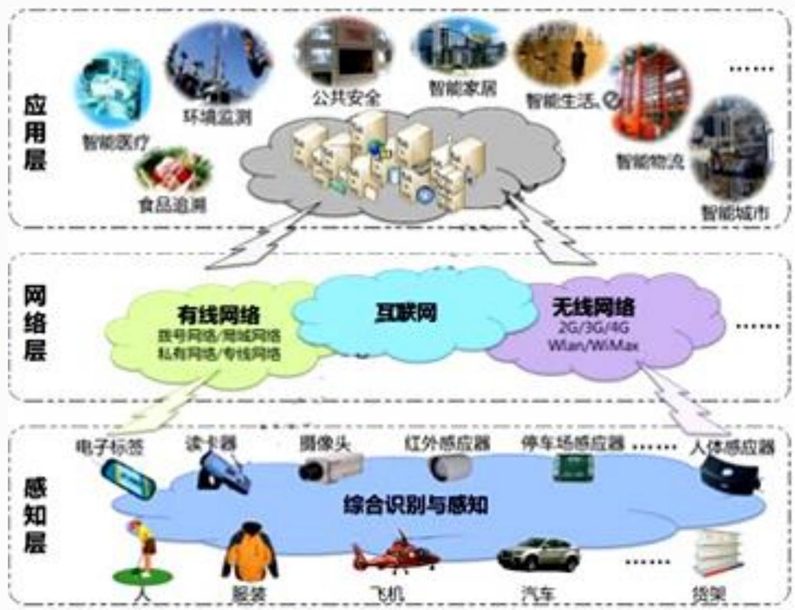
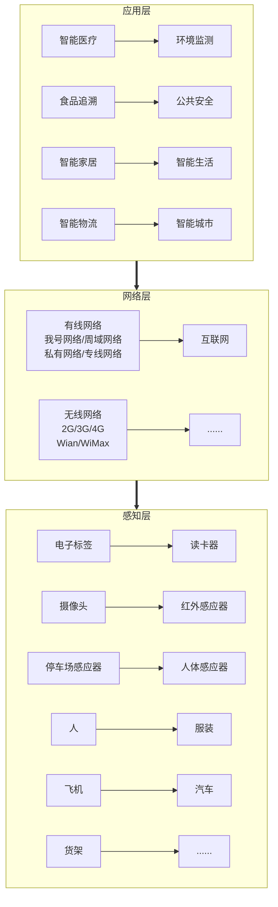
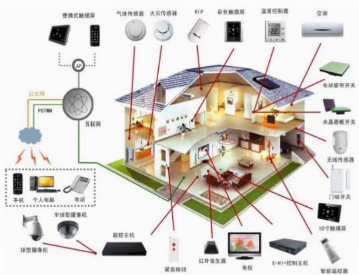
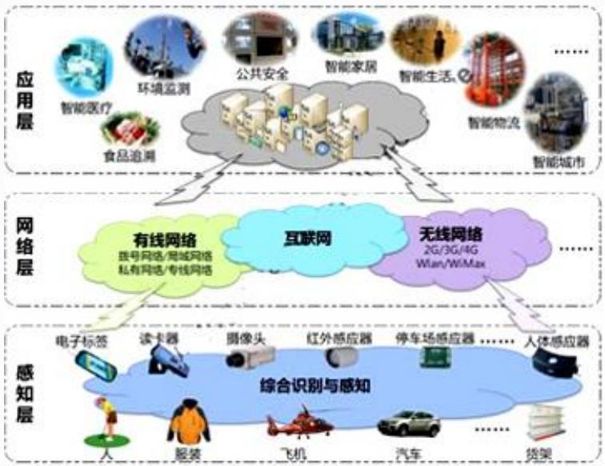
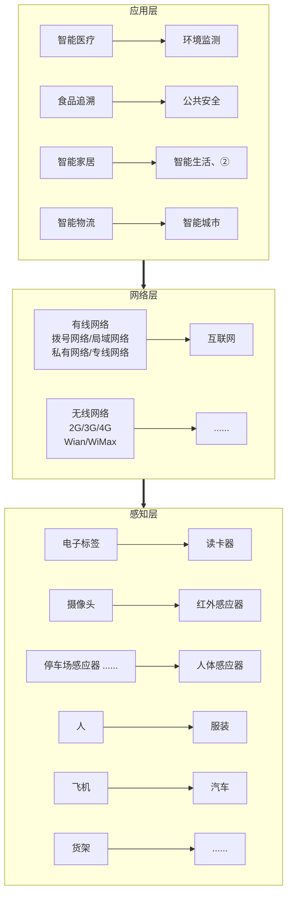

## 系统架构设计师

## 数据架构规划与设计

## 第十三章 层次式架构设计理论与实践

13.1 层次式体系结构概述  
13.2 表现层框架设计  
13.3 中间层架构设计  
13.4 数据访问层设计  
13.5 数据架构规划与设计  
13.6 物联网层次架构设计

## 一、数据库设计与XML设计融合XML 文档分为两类：

<table><tr><td>序号</td><td>日期</td><td>组别</td><td>销售员</td><td>销售产品</td><td>规格型号</td><td>单位</td><td>数量</td><td>单价</td><td>折扣</td><td>实收金额</td><td>备注</td></tr><tr><td>1</td><td>2020/12/1</td><td>销售二组</td><td>销售1</td><td>产品1</td><td>规格1</td><td>个</td><td>10</td><td>100.00</td><td>0.95</td><td>950.00</td><td></td></tr><tr><td>2</td><td>2020/12/2</td><td>销售一组</td><td>销售2</td><td>产品2</td><td>规格2</td><td>个</td><td>19</td><td>100.00</td><td>0.98</td><td>1,862.00</td><td></td></tr><tr><td>3</td><td>2020/12/3</td><td>销售一组</td><td>销售3</td><td>产品3</td><td>规格3</td><td>个</td><td>20</td><td>100.00</td><td>0.99</td><td>1,980.00</td><td></td></tr><tr><td>4</td><td>2020/12/4</td><td>销售一组</td><td>销售4</td><td>产品4</td><td>规格4</td><td>个</td><td>13</td><td>100.00</td><td>0.95</td><td>1,235.00</td><td></td></tr><tr><td>5</td><td>2020/12/5</td><td>销售二组</td><td>销售5</td><td>产品5</td><td>规格5</td><td>个</td><td>15</td><td>100.00</td><td>0.98</td><td>1,470.00</td><td></td></tr><tr><td>6</td><td>2020/12/6</td><td>销售二组</td><td>销售7</td><td>产品6</td><td>规格6</td><td>个</td><td>20</td><td>100.00</td><td>0.92</td><td>1,840.00</td><td></td></tr><tr><td>7</td><td>2020/12/7</td><td>销售二组</td><td>销售8</td><td>产品7</td><td>规格7</td><td>个</td><td>14</td><td>100.00</td><td>0.95</td><td>1,330.00</td><td></td></tr><tr><td>8</td><td>2020/12/8</td><td>销售二组</td><td>销售9</td><td>产品8</td><td>规格8</td><td>个</td><td>12</td><td>100.00</td><td>0.98</td><td>1,176.00</td><td></td></tr><tr><td>9</td><td>2020/12/9</td><td>销售三组</td><td>销售12</td><td>产品9</td><td>规格9</td><td>个</td><td>16</td><td>100.00</td><td>0.99</td><td>1,584.00</td><td></td></tr><tr><td>10</td><td>2020/12/10</td><td>销售三组</td><td>销售13</td><td>产品10</td><td>规格10</td><td>个</td><td>20</td><td>100.00</td><td>0.95</td><td>1,900.00</td><td></td></tr><tr><td>11</td><td>2020/12/11</td><td>销售三组</td><td>销售14</td><td>产品11</td><td>规格11</td><td>个</td><td>13</td><td>100.00</td><td>0.98</td><td>1,274.00</td><td></td></tr><tr><td>12</td><td>2020/12/12</td><td>销售三组</td><td>销售15</td><td>产品12</td><td>规格12</td><td>个</td><td>15</td><td>100.00</td><td>0.92</td><td>1,380.00</td><td></td></tr><tr><td>13</td><td>2020/12/13</td><td>销售三组</td><td>销售16</td><td>产品13</td><td>规格13</td><td>个</td><td>20</td><td>100.00</td><td>0.98</td><td>1,960.00</td><td></td></tr><tr><td></td><td></td><td></td><td></td><td></td><td></td><td></td><td></td><td></td><td></td><td>-</td><td></td></tr><tr><td></td><td></td><td></td><td></td><td></td><td></td><td></td><td></td><td></td><td></td><td>-</td><td></td></tr></table>

##

⚫ 以数据为中心的文档，这种文档在结构上是规则的，在内容上是同构的，具有较少的混合内容和嵌套层次，只关心文档中的数据而并不关心数据元素的存放顺序，这种文档简称为数据文档，常用来存储和传输Web 数据。如XML文档包含销售数据、餐馆菜单。  
以文档为中心的文档，这种文档的结构不规则，内容比较零散，具有较多的混合内容，并且元素之间的顺序是有关的，这种文档常用来在网页上发布描述性信息、产品性能介绍和 E-mail信息等。 

## XML文档的存储方式有两种：

(1)基于文件的存储方式。基于文件的存储方式是指将 XML 文档按其原始文本形式存储。这种存储方式需维护某种类型的附加索引，以建立文件之间的层次结构。

## 基于文件的存储方式的特点：

无法获取 XML 文档中的结构化数据；  
通过附加索引可以定位具有某些关键字的 XML 文档，一旦关键字不确定，将很难定位；  
查询时只能以原始文档的形式返回，即不能获取文档内部信息；  
文件管理存在容量大、管理难的缺点。

(2)数据库存储方式。数据库在数据管理方面具有管理方便、存储占用空间小、检索速度快、修改效率高和安全性好等优点。采用数据库对 XML 文档进行存取和操作，这样可以利用相对成熟的数据库技术处理XML 文档内部的数据。

数据库存储方式的特点：

能够管理结构化和半结构化数据；  
具有管理和控制整个文档集合本身的能力；  
可以对文档内部的数据进行操作；  
⚫ 具有数据库技术的特性，如多用户、并发控制和一致性约束等。  
管理方便，易于操作。

## 第十三章 层次式架构设计理论与实践

13.1 层次式体系结构概述  
13.2 表现层框架设计  
13.3 中间层架构设计  
13.4 数据访问层设计  
13.5 数据架构规划与设计  
13.6 物联网层次架构设计

## 物联网层次架构

应用层  
网络层  
感知层

flowchart

## 1.感知层

感知层用于识别物体、采集信息。感知层包括二维码标签和识读器、RFID 标签和读写器、摄像头、GPS、传感器、M2M 终端、传

感器网关等，主要功能是识别对象、采集信息。

感知层解决的是数据获取问题。它首先通过传感器、数码相机等设备，采集外部物理世界的数据，然后通过 RFID、条码、工业现场总线、蓝牙、红外等短距离传输技术传递数据。

感知层的关键技术包括检测技术、短距离无线通信技术等。

text_image

便携式触摸屏
气体传感器
火灾传感器
RIP
彩色触摸屏
温度控制器
空调
以太网
PSTMN
互联网
手机
个人电脑
电话
半球型摄像机
球型摄像机
监控主机
紧急按钮
红外发生器
电视
E-W1+控制主机
智能遥控器
电动窗帘开关
水晶面板开关
无线传感器
门磁开关
10寸触摸屏

## 2.网络层

网络层将感知层获取的信息进行传递和处理，数据可以通过移动通信网、互联网、企业内部网、各类专网、小型局域网进行传输。

物联网的网络层是建立在现有的移动通信网和互联网基础上的。

网络层的关键技术包括长距离有线和无线通信技术、网络技术等。

flowchart

## 3.应用层

应用层解决的是信息处理和人机交互问题。网络层传输来的数据在这一层进入各类信息系统进行处理，并通过各种设备与人进行交互。应用层分为两个子层：

应用程序层，进行数据处理，涵盖了国民经济和社会的每一领域，包括电力、医疗银行、交通、环保、物流、工业、农业、城市管理、家居生活等，是物联网作为深度信息化的重要体现。  
终端设备层，提供人机接口。

## Thank You