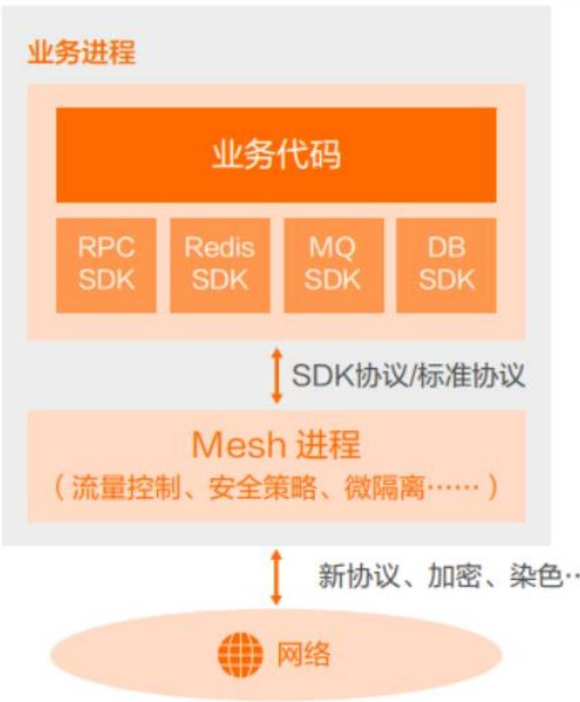
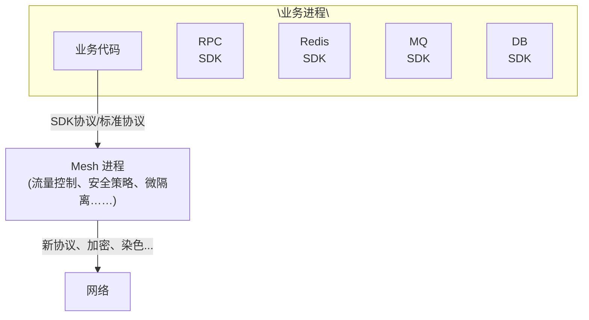

## 系统架构设计师

## 云原生架构内涵

## 第十四章 云原生架构设计理论与实践

⚫ 14.1 云原生架构内涵  
14.2 云原生架构相关技术

## 云原生架构定义

从技术的角度，云原生架构是基于云原生技术的一组架构原则和设计模式的集合，旨在将云应用中的非业务代码部分进行最大化的剥离，从而让云设施接管应用中原有的大量非功能特性(如弹性、韧性、安全、可观测性、灰度等)，使业务不再有非功能性业务中断困扰的同时，具备轻量、敏捷、高度自动化的特点。

软件架构的目的是帮助开发团队将关注点聚焦在业务代码的实现上。通常，开发软件系统，代码包含三部分内容：处理业务逻辑的代码、第三方依赖、处理非功能特性的代码。这三部分中只有业务代码真正产生业务价值，另外两个部分都只算附属物。软件规模越大、非功能特性要求越复杂，非业务代码开发量越大，复杂度越高，系统迭代会越来越缓慢，成本越来越高。所以，在软件规模较大、功能复杂的情况下又要保证敏捷迭代，就需要将非业务代码尽可能剥离出来，利用可靠的第三方托管服务来提升开发效率和系统质量。云平台提供了丰富的用于处理非功能需求的高级项目经理服务和组件，利用云原生架构充分利用云平台上的各类资源，可以很好的解决这方面的问题。

## 二、云原生架构原则

1.服务化原则  
2.弹性原则  
3.可观测原则  
4.韧性原则  
5.所有过程自动化原则  
6.零信任原则  
7.架构持续演进原则

## 1.服务化原则

当代码规模超出小团队的合作范围时，就有必要进行服务化拆分了，包括拆分为微服务架构、小服务 (MiniService) 架构，通过服务化架构把不同生命周期的模块分离出来，分别进行业务迭代，避免迭代频繁的模块被慢速模块拖慢，从而加快整体的进度和稳定性。同时服务化架构以面向接口编程，服务内部的功能高度内聚，模块间通过公共功能模块的提取增加软件的复用程度。

## 2.弹性原则

弹性原则是指系统的部署规模可以随着业务量的变化而自动伸缩，无须根据事先的容量规划固定的硬件和软件资源。好的弹性能力不仅缩短了从采购到上线的时间，让企业不用操心额外软硬件资源的成本支出(闲置成本)，降低了企业的IT 成本，更关键的是当业务规模面临海量突发性扩张的时候，不再因为平时软硬件资源储备不足而“说不”，保障了企业收益。

## 3.可观测原则

企业的软件规模在不断增长，原来单机可以对应用做完所有调试，但在分布式环境下需要对多个主机上的信息做关联，才可能回答清楚服务为什么宕机、目前的故障影响哪些用户等问题，这些都要求系统具备更强的可观测能力。可观测性是在分布式系统中，主动通过日志、链路跟踪和度量等手段，让一次点击背后的多次服务调用的耗时、返回值和参数都清晰可见，甚至下钻到每次三方软件调用、SQL 请求、节点拓扑、网络响应等，这样的能力可以使运维、开发和业务人员实时掌握软件运行情况，并结合多个维度的数据指标，获得前所未有的关联分析能力，不断对业务健康度和用户体验进行数字化衡量和持续优化。 

## 4.韧性原则

业务上线后，最不能接受的就是业务不可用，影响体验和收入。韧性代表了当软件所依赖的软硬件组件出现异常时，软件表现出来的抵御能力，这些异常通常包括硬件故障、 硬件资源瓶颈(如CPU/网卡带宽耗尽)、业务流量超出软件设计能力、影响机房工作的故障和灾难、 软件bug、黑客攻击等对业务不可用带来致命影响的因素。韧性从多个维度诠释了软件持续提供业务服务的能力，核心目标是降低软件的 MTBF。从架构设计上，韧性包括服务异步化能力、重试 / 限流 / 降级 / 熔断 / 反压、主从模式、集高级项目经理群模式、AZ 内的高可用、单元化、跨region容灾、异地多活容灾等。

## 5.所有过程自动化原则

容器、微服务、DevOps、大量第三方组件的使用，在降低分布式复杂性和提升迭代速度的同时，因为整体增大了软件技术栈的复杂度和组件规模，所以不可避免地带来了软件交付的复杂性，如果这里控制不当，应用就无法体会到云原生技术的优势。通过IaC、GitOps、OAM、KubernetesOperator 和大量自动化交付工具在 CI/CD 流水线中的实践，一方面标准化企业内部的软件交付过程，另一方面在标准化的基础上进行自动化，通过配置数据自描述和面向终态的交付过程让自动化工具理解交付目标和环境差异，实现整个软件交付和运维的自动化。 

## 6.零信任原则

零信任安全核心思想是，默认情况下不应该信任网络内部和外部的任何人/设备/系统，需要基于认证和授权重构访问控制的信任基础，诸如IP 地址、主机、地理位置、所处网络等均不能作为可信的凭证。零信任引导安全体系架构从“网络中心化”走向“身份中心化”，其本质诉求是以身份为中心进行访问控制。零信任第一个核心问题就是身份，赋予不同的实体不同的身份，解决是谁在什么环境下访问某个具体的资源的问题。在研发、测试和运维微服务场景下，身份及其相关策略不仅是安全的基础，更是众多(资源、服务、环境)隔离机制的基础。 

## 7.架构持续演进原则

云原生架构本身也必须是一个具备持续演进能力的架构，而不是一个封闭式架构。除了增量迭代、目标选取等因素外，还需要考虑组织(例如架构控制委员会)层面的架构治理和风险控制，特别是在业务高速迭代情况下的架构、业务、实现平衡关系。

云原生架构对于新建应用而言的架构控制策略相对容易选择(选择弹性、敏捷、成本的维度)，但对于存量应用向云原生架构迁移，则需要从架构上考虑遗留应用的迁出成本/风险和到云上的迁入成本/风险，以及技术上通过微服务/应用网关、应用集成、适配器、服务网格、数据迁移、在线灰度等应用和流量进行细颗粒度控制。 高级项目经理 任

## 三、主要架构模式

## 1.服务化架构模式

服务化架构是云时代构建云原生应用的标准架构模式，要求以应用模块为颗粒度划分一个软件，以接口契约(例如IDL) 定义彼此业务关系，以标准协议 (HTTP、gRPC 等)确保彼此的互联通，结合DDD(领域模型驱动)、TDD(测试驱动开发)、容器化部署提升每个接口的代码质量和迭代速度。

服务化架构的典型模式是微服务和小服务模式，其中小服务可以看作是一组关系非常密切的服务的组合，这组服务会共享数据。

小服务模式通常适用于非常大型的软件系统，避免接口的颗粒度太细而导致过多的调用损耗(特别是服务间调用和数据一致性处理)和治理复杂度。

通过服务化架构，把代码模块关系和部署关系进行分离，每个接口可以部署不同数量的实例，单独扩缩容，从而使得整体的部署更经济。此外，由于在进程级实现了模块的分离，每个接口都可以单独升级，从而提升了整体的迭代效率。但也需要注意，服务拆分导致要维护的模块数量增多，如果缺乏服务的自动化能力和治理能力，会让模块管理和组织技能不匹配，反而导致开发和运维效率的降低。 

## 2.Mesh化架构模式

Mesh 化架构是把中间件框架(如 RPC、缓存、异步消息等)从业务进程中分离，让中间性SDK 与业务代码进一步解耦，从而使得中间件升级对业务进程没有影响，其至迁移到另外一个平台的中间件也对业务透明。分离后在业务进程中只保留很"薄"的 Client 部分，Client 通常很少变化，只负责与 Mesh 进程通信，原来需要在SDK 中处理的流量控制、安全等逻辑由Mesh进程完成。

实施Mesh化架构后，大量分布式架构模式(熔断、限流、降级、重试、反压、隔仓)都由Mesh 进程完成，即使在业务代码的制品

中并没有使用这些三方软件包；同时获得更好的安全性(比如零信任架构能力)、按流量进行动态环境隔离、基于流量做冒烟/回归测试等。

flowchart

## 3.Serverless 模式

Serverless 将“部署”这个动作从运维中“收走”，使开发者不用关心应用运行地点、操作系统、网络配置、CPU 性能等，从架构抽象上看，当业务流量到来/业务事件发生时，云会启动或调度一个已启动的业务进程进行处理，处理完成后云自动会关闭/调度业务进程，等待下一次触发，也就是把应用的整个运行都委托给云。

Serverless 并非适用任何类型的应用，因此架构决策者需要关心应用类型是否适合于Serverless运算。如果应用是有状态的，由于

Serverless 的调度不会帮助应用做状态同步，因此云在进行调度时可能导致上下文丢失；如果应用是长时间后台运行的密集型计算任务，会无法发挥 Serverless 的优势；如果应用涉及频繁的外部I/O(网络或者存储，以及服务间调用)，也因为繁重的I/O负担、时延大而不适合。

Serverless 非常适合于事件驱动的数据计算任务、计算时间短的请求/响应应用、没有复杂相互调用的长周期任务。

## Thank You