## 系统架构设计师

## 云原生架构相关技术

## 第十四章 云原生架构设计理论与实践

14.1 云原生架构内涵  
⚫ 14.2 云原生架构相关技术

## 容器技术

容器作为标准化软件单元，它将应用及其所有依赖项打包，在运行的时候就不再依赖宿主机上的文件操作系统类型和配置。帮助开发者跳过设置冗杂的开发环境，不用担心不同环境下的软件运行的环境配置问题（将应用程序的配置和所有依赖打包成一个镜像在容器中）。在不同计算环境间快速、可靠地运行。

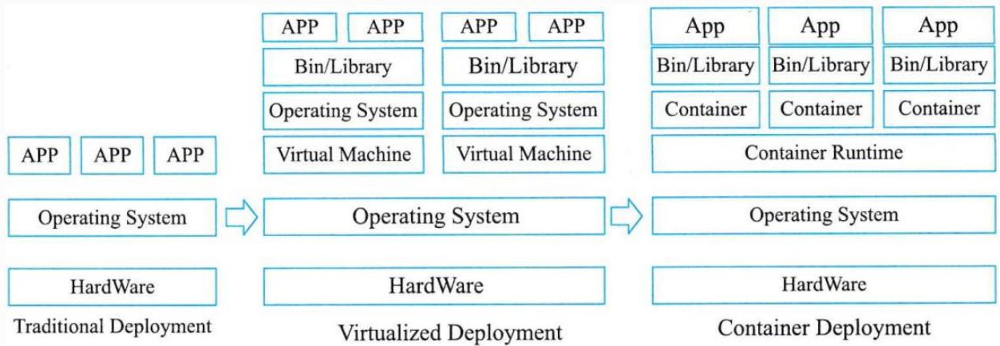

flowchart

This diagram illustrates the architecture of a container system, showing how traditional deployment leads to virtualized deployment and finally container deployment.

图14-3传统、虚拟化、容器部署模式比较

## 1.容器编排

Kubernetes 已经成为容器编排的事实标准，被广泛用于自动部署，扩展和管理容器化应用，是一个全新的基于容器技术的分布式架构解决方案。Kubernetes 提供了分布式应用管理的核心能力。

资源调度：根据应用请求的CPU、Memory资源量，或者GPU等设备资源，在集群中选择合适的节点来运行应用。  
应用部署与管理：支持应用的自动发布与应用的回滚，以及与应用相关的配置的管理；也可以自动化存储卷的编排，让存储卷与容器应用的生命周期相关联。

自动修复：Kubernetes能监测这个集群中所有的宿主机，当宿主机或者OS出现故障，节点健康检查会自动进行应用迁移；K8s也支持应用的自愈，极大简化了运维管理的复杂性。  
服务发现与负载均衡：Service是对一组提供相同功能的Pods的抽象，并为它们提供一个统一的入口。借助Service，应用可以方便的实现服务发现与负载均衡，并实现应用的零宕机升级。。  
弹性伸缩：K8s可以监测业务上所承担的负载，如果这个业务本身的CPU利用率过高，或者响应时间过长，它可以对这个业务进行自动扩容。

## 二、云原生微服务

## 1.微服务的发展背景

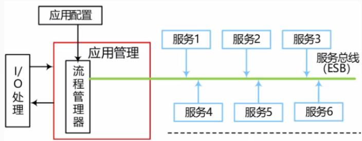

flowchart

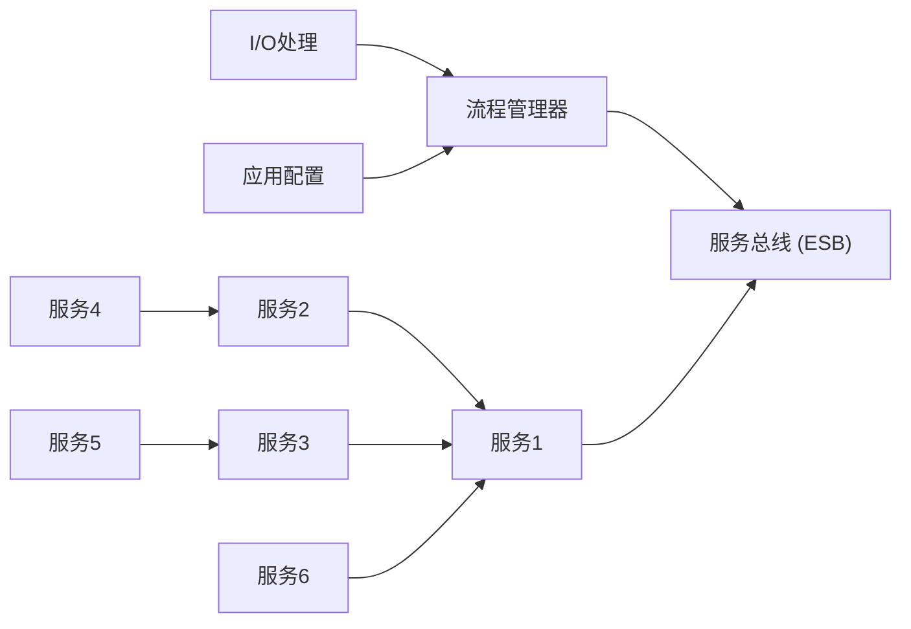

第一代：单体架构  

natural_image

Abstract black-and-white mechanical gear diagram with interconnected gears and circles (no text or symbols)

·紧耦合  
·系统复杂、错综交互，牵一发 而动全身  
重复制造各种轮子：OS、DB、Middleware  
·完全封闭的架构

架构  

natural_image

Abstract mechanical diagram with interconnected gears and gears (no text or symbols)

·松耦合  
·在大型、超大型企业中仍然流行  
·通常通过ESB进行系统集成  
  
  
·集中式、计划内停机扩容

第三代：微服务架构  
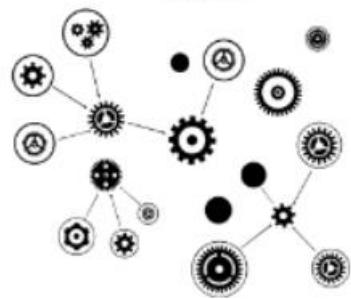

natural_image

Abstract diagram of interconnected gears and circles with no text or symbols

·解耦  
·互联网公司、中小企业、初创公司  
  
·TTM:按天、周进行升级发布  
  
·可扩展性：自动弹性伸缩  
·高可用：升级、扩容不中断业务

## 2.微服务的概念

微服务架构是一种架构模式，将单体应用划分成一组小的服务，通过服务之间互相协作，共同实现系统功能。

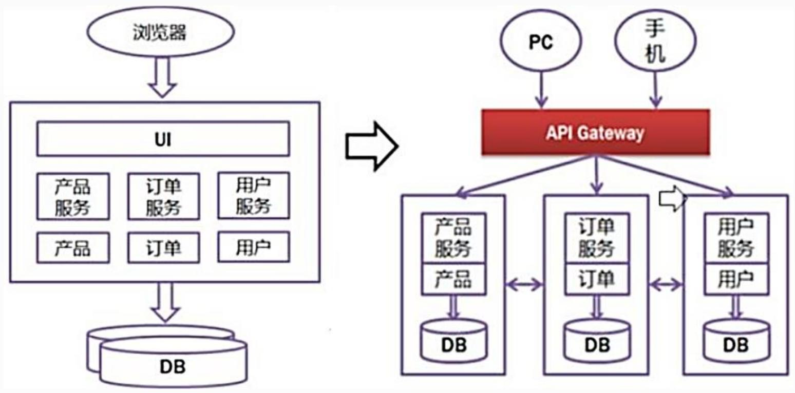

flowchart

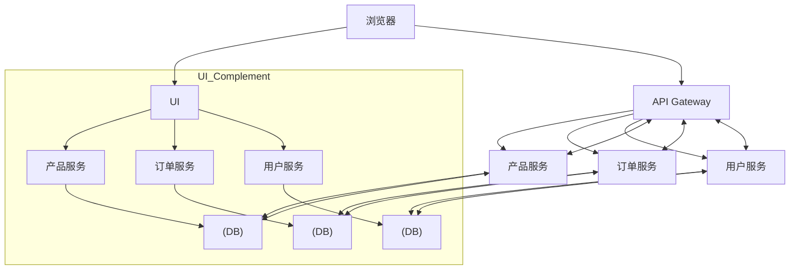

微服务与单体架构区别：

<table><tr><td>单体架构</td><td>微服务架构</td></tr><tr><td>模块全都耦合在一块,代码量大,维护困难。</td><td>每个模块相当于一个单独的项目,代码量明显减少,遇到问题也相对来说比较好解决。</td></tr><tr><td>所有的模块共用一个数据库,存储方式单一。</td><td>每个模块可以使用不同的存储方式(如有的用redis,有的用mysql)。</td></tr><tr><td>所有的模块开发所使用的技术一样。</td><td>每个模块都可以使用不同的开发技术,开发模式更灵活。</td></tr></table>

微服务与面向服务的架构(SOA)区别：

微服务是细粒度的SOA组件。换句话说，单个SOA组件可被拆分成多个微服务。微服务使用轻量级HTTP、REST或Thrift API进行通信。

<table><tr><td>面向服务的架构(SOA)</td><td>微服务架构</td></tr><tr><td>是一个巨大的服务集合,采用集中式管理。</td><td>将大量的服务分解成小的服务或可共享的组件。采用去中心化管理。</td></tr><tr><td>支持各种多协议,使用ESB服务进行通信。</td><td>支持HTTP/REST轻量级协议。有一个简单的消息传递系统。</td></tr><tr><td>被用来共享数据存储。</td><td>有独立的数据存储。</td></tr><tr><td>容器(如Docker)的使用不太受欢迎。</td><td>容器在微服务方面效果很好。</td></tr></table>

例：以下关于微服务架构与面向服务架构的描述中，正确的是( )。

A.两者均采用去中心化管理  
B.两者均采用集中式管理  
C.微服务架构采用去中心化管理，面向服务架构采用集中式管理  
D.微服务架构采用集中式管理，面向服务架构采用去中心化管理

## 3.微服务的特征

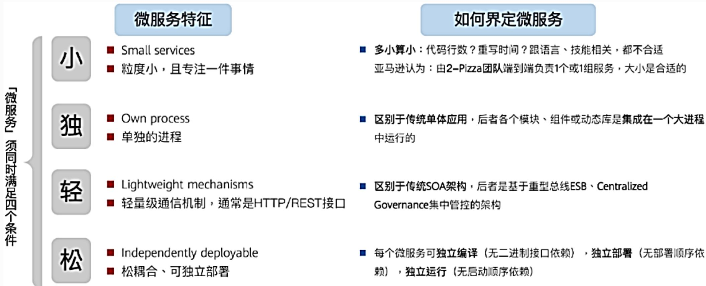

flowchart

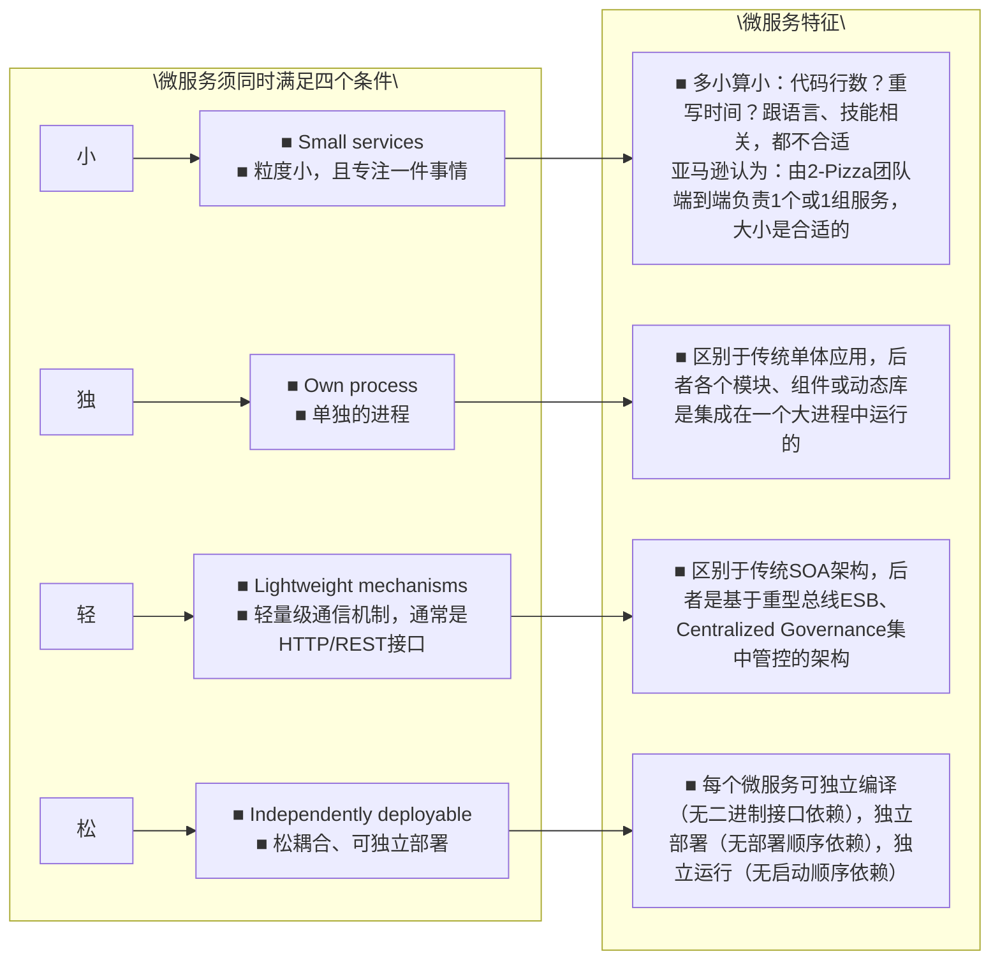

## 4.主要的微服务技术

Apache Dubbo是阿里的一款高性能、轻量级的开源服务框架，提供了六大核心能力：面向接口代理的高性能RPC调用，智能容错和负载均衡，服务自动注册和发现，高度可扩展能力，运行期流量调度，可视化的服务治理与运维。  
Spring Cloud是一系列框架的有序集合，具有丰富的生态。它利用Spring Boot的开发便利性简化了分布式系统基础设施的开发，主要功能包括服务发现注册、配置中心、消息总线、负载均衡、断路器、数据监控等。

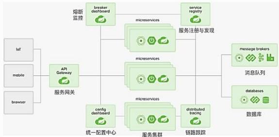

flowchart

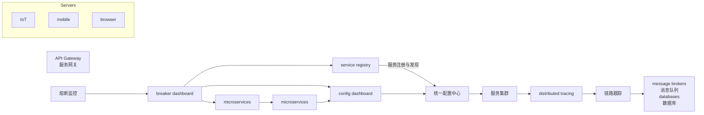

## 三、服务网格

服务网格(Service Mesh)是一个专门处理服务通讯的基础设施层。它的职责是在由云原生应用组成服务的复杂拓扑结构下进行可靠的请求传送。在实践中，它是一组和应用服务部署在一起的轻量级的网络代理，并且对应用服务透明。

服务网格把 SDK 中的大部分能力从应用中剥离出来，拆解为独立进程，以Sidecar 的模式进行部署。服务网格通过将服务通信及相关管控功能从业务程序中分离并下沉到基础设施层，使其和业务系统完全解耦，使开发人员更加专注于业务本身。

服务网格从总体架构上来讲比较简单，不过是一堆紧挨着各项服务的用户代理，外加一组任务管理组件组成。

管理组件被称为控制平面(Control plane)，负责与控制平面中的代理通信，下发策略和配置。  
代理被称为数据平面(Data plane)，直接处理入站和出站数据包，转发、路由、健康检查、负载均衡、认证、鉴权、产生监控数  
据等。

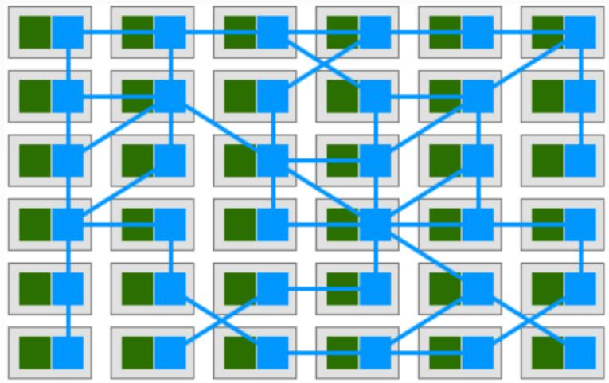

flowchart

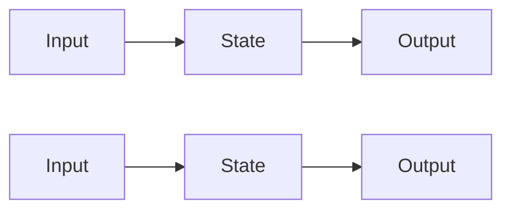

Istio 是一个由Google和IBM等公司开源的，功能十分丰富的服务网格具体实现，也是目前业界最为流行的实现。

Istio 的架构从逻辑上分成数据平面和控制平面。

数据平面：由一组和业务服务成对出现的 Sidecar 代理（Envoy）构成，主要功能是接管服务的进出流量，传递并控制服务和Mixer 组件的所有网络通信。  
控制平面：包括了 Pilot、Mixer、Citadel 和Galley 4 个组件，主要功能是通过配置和管理Sidecar 代理来进行流量控制，并配置Mixer 去执行策略和收集遥测数据。

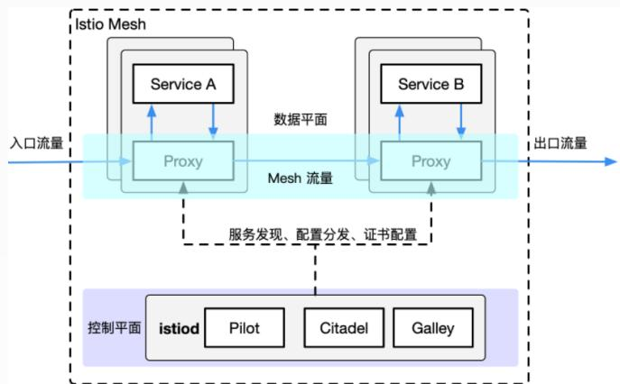

flowchart

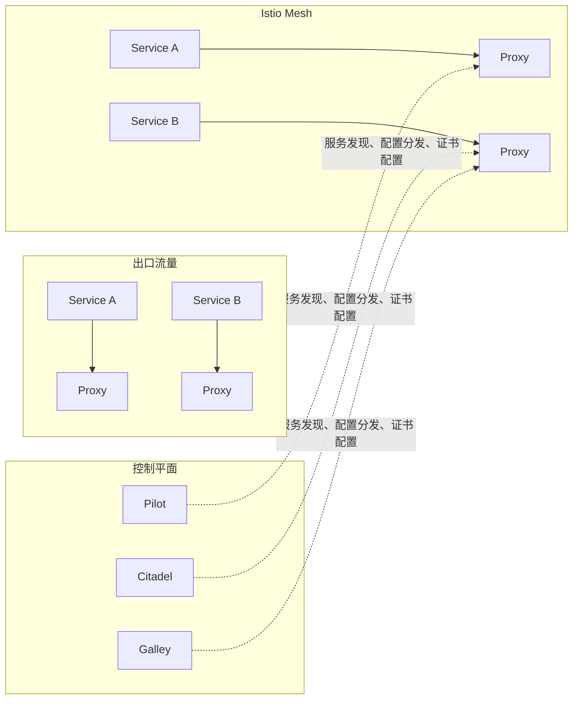

## Thank You