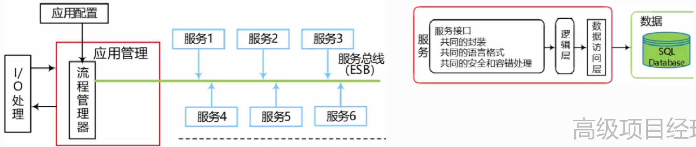
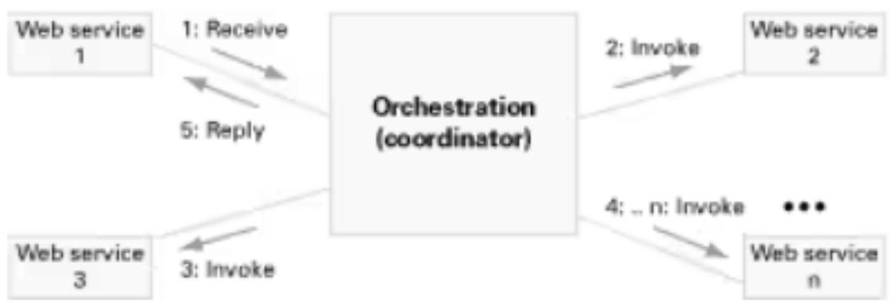
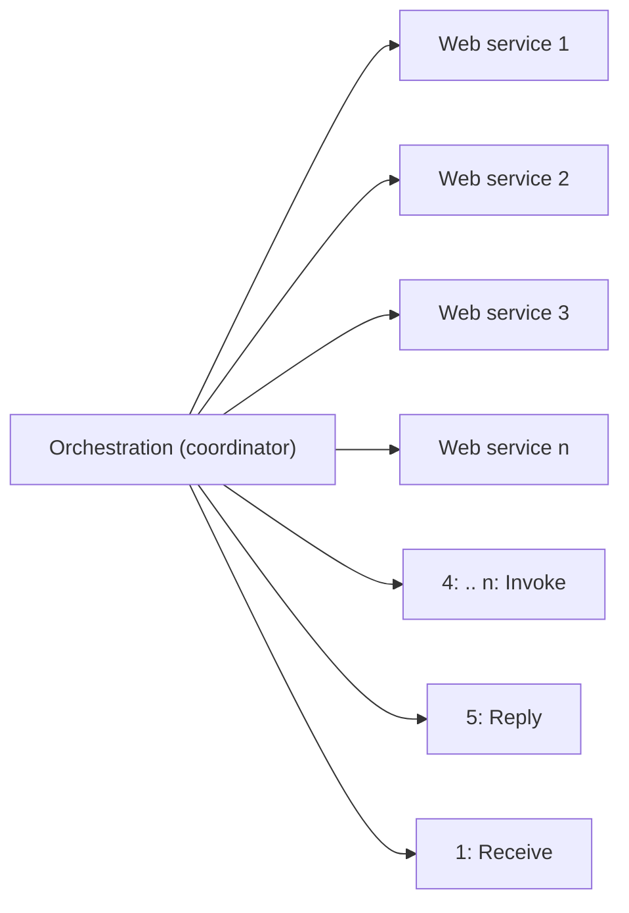
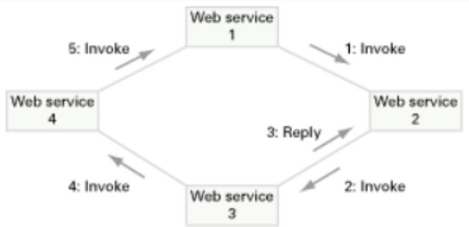
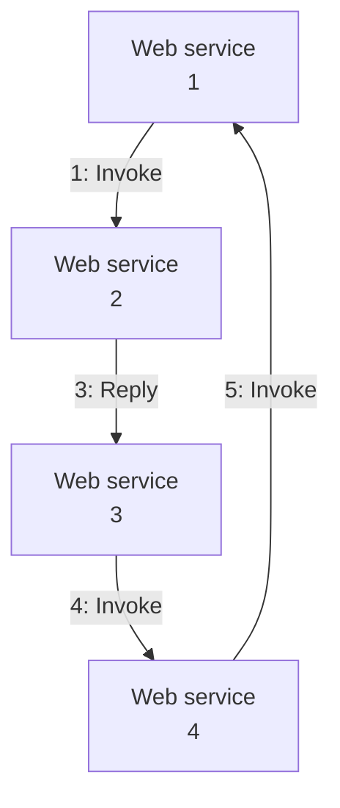
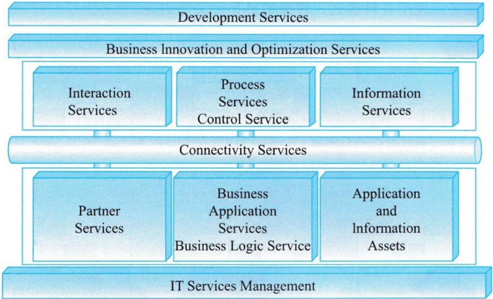
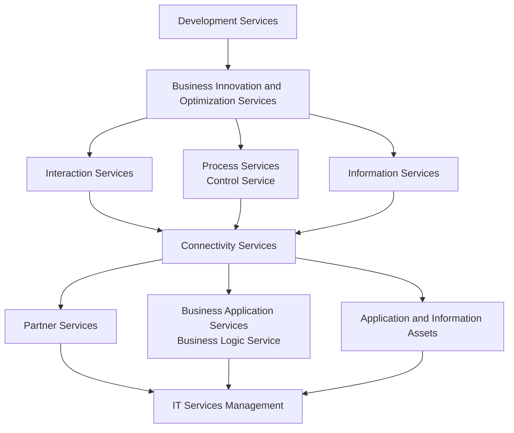
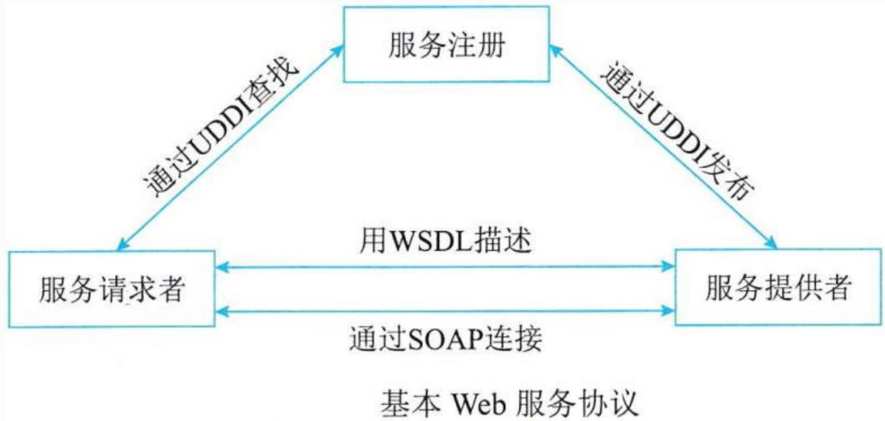
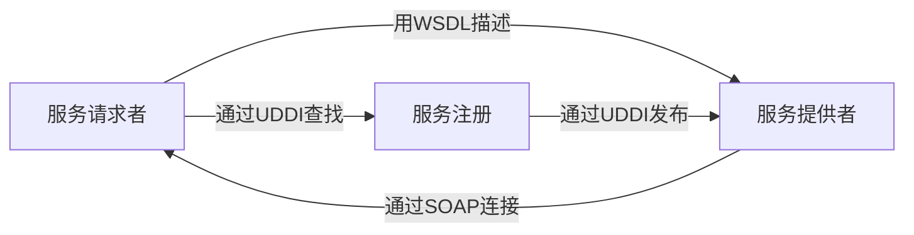

## 系统架构设计师

## SOA相关概念

## 第十五章 面向服务架构设计理论与实践

⚫ 15.1 SOA的相关概念  
15.2 SOA的参考架构  
15.3 SOA主要协议和规范  
15.4 SOA的设计原则  
15.5 SOA的设计模式

## 一、面向服务的架构(SOA)的定义

SOA 是一个组件模型，它将应用程序的不同功能单元(称为服务)通过这些服务之间定义良好的接口和契约联系起来。接口是采用中立的方式进行定义的，它应该独立于实现服务的硬件平台、操作系统和编程语言。这使得构建在各种这样的系统中的服务可以以一种统一和通用的方式进行交互。

## 二、业务流程与BPEL

业务流程是指为了实现某种业务目的行为所进行的流程或一系列动作。在计算机领域，业务流程代表的是某一个问题在计算机系统内部得到解决的全部流程。

BPEL(面向Web 服务的业务流程执行语言)，是一种基于XML的用来描写业务过程的编程语言，被描写的业务过程的每个单一步骤则由Web服务来实现。使用 BPEL，用户可以通过组合、编排和协调 Web 服务自上而下地实现面向服务的体系结构(SOA)。BPEL 提供了一种相对简单易懂的方法，可将多个 Web 服务组合到一个新的复合服务(称作业务流程) 中。 

## 两种方式组合 Web 服务：

编制  
编排

flowchart

图1：通过编制组合Web服务

flowchart

图2：通过编排组合Web服务

## 第十五章 面向服务架构设计理论与实践

15.1 SOA的相关概念  
⚫ 15.2 SOA的参考架构  
15.3 SOA主要协议和规范  
15.4 SOA的设计原则  
15.5 SOA的设计模式

从服务为中心的视角来看，企业集成的架构划分为6大类。

(1)IT 服务管理 (IT Service Management):支持业务系统运行的各种基础设施管理能力或服务，如安全服务、目录服务、系统管理和资源虚拟化。  
(2)业务逻辑服务(Business Logic Service): 包括用于实现业务逻辑的服务和执行业务逻辑的能力，其中包括业务应用服务、业务伙伴服务以及应用和信息资产。  
(3)连接服务(Connectivity Service):通过提供企业服务总线提供分布在各种架构元素服务间的连接性。

(4)控制服务(Control Service): 包括实现人、流程和信息集成的服务，以及执行这些集成逻辑的能力。  
(5)业务创新和优化服务(Business Innovation and OptimizationService):用于监控业务系统运行时服务的业务性能，并通过及时了解到的业务性能和变化，采取措施适应变化的市场。  
(6)开发服务(Development Service):贯彻整个软件开发生命周期的开发平台，从需求分析，到建模、设计、开发、测试和维护等全面的工具支持。

flowchart

图15-2 IBMWebSphere业务集成参考架构

## 第十五章 面向服务架构设计理论与实践

15.1 SOA的相关概念  
15.2 SOA的参考架构  
⚫ 15.3 SOA主要协议和规范  
15.4 SOA的设计原则  
15.5 SOA的设计模式

Web 服务作为实现 SOA 中服务的最主要手段。Web 服务最基本的协议包括UDDI、WSDL和SOAP，通过它们，可以提供直接而又简单的 Web Service 支持。

flowchart

## 、 UDDI协议

UDDI(统一描述、发现和集成协议)是一种用于描述、发现、集成Web Service的技术，它是Web Service协议栈的一个重要部分。通过UDDI，企业可以根据自己的需要动态查找并使用Web服务，也可以将自己的Web服务动态地发布到UDDI注册中心，供其他用户使用。

flowchart

## 二、WSDL规范

WSDL (Web 服务描述语言)，是一个用来描述 Web 服务和说明如何与 Web 服务通信的XML语言。也就是描述与目录中列出的Web服务进行交互时需要绑定的协议和信息格式。WSDL描述Web服务的公共接口。通过WSDL，可描述Web 服务的三个基本属性。

(1)服务做些什么--服务所提供的操作 (方法)。  
(2)如何访问服务--和服务交互的数据格式以及必要协议。  
(3)服务位于何处--协议相关的地址，如 URL。

WSDL文档以端口集合的形式来描述 Web 服务，WSDL服务描述包含对一组操作和消息的一个抽象定义，绑定到这些操作和消息的一个具体协议，和这个绑定的一个网络端点规范。

WSDL文档被分为两种类型：服务接口和服务实现。

## 三、SOAP协议

SOAP(简单对象访问协议)是在分散或分布式的环境中交换信息的简单协议，是一种轻量的、简单的、基于XML 的协议。包括4部分：

封装(Envelop)：定义了一个框架 , 该框架描述了消息的内容是什么，是谁发送的，谁应当接收并处理以及如何处理它；  
编码规则：定义了一种序列化的机制，用于表示应用程序需要使用的数据类型的实例；  
⚫ SOAP RPC 表示：定义了用于表示远程过程调用和应答的协定；  
绑定(Binding)：定义了SOAP使用哪种协议交换信息。HTTP/TCP/UDP协议都可以。 

## Thank You