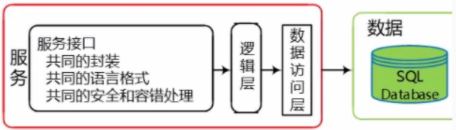
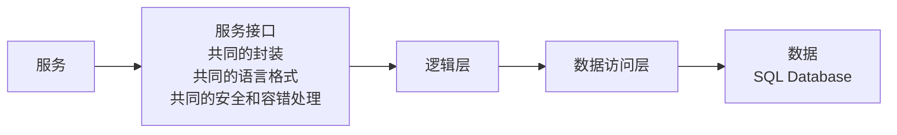
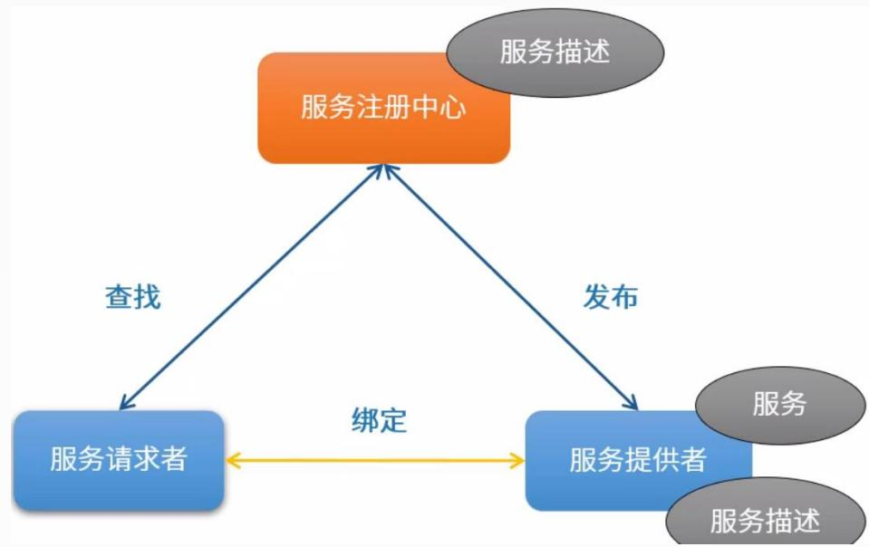
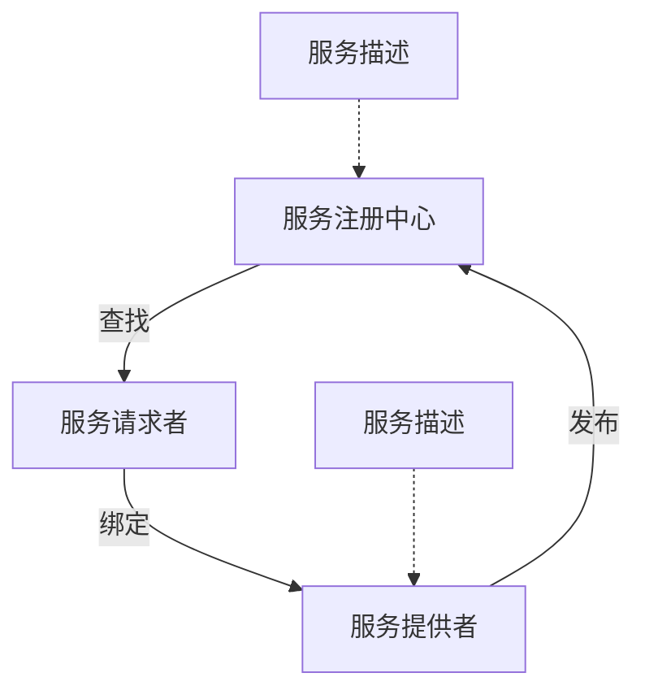
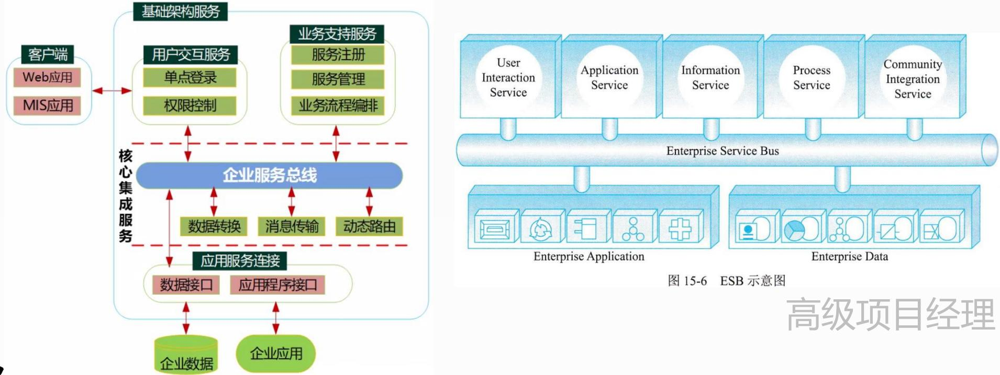
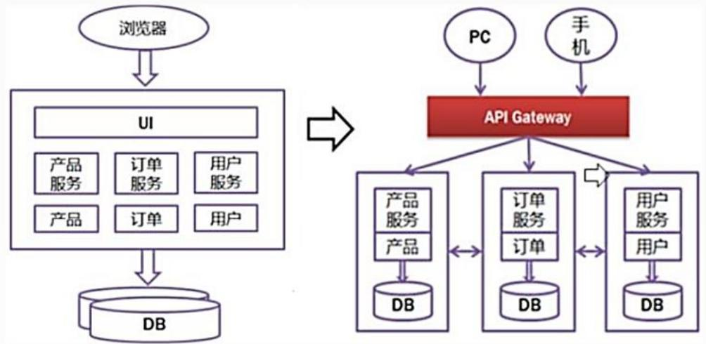
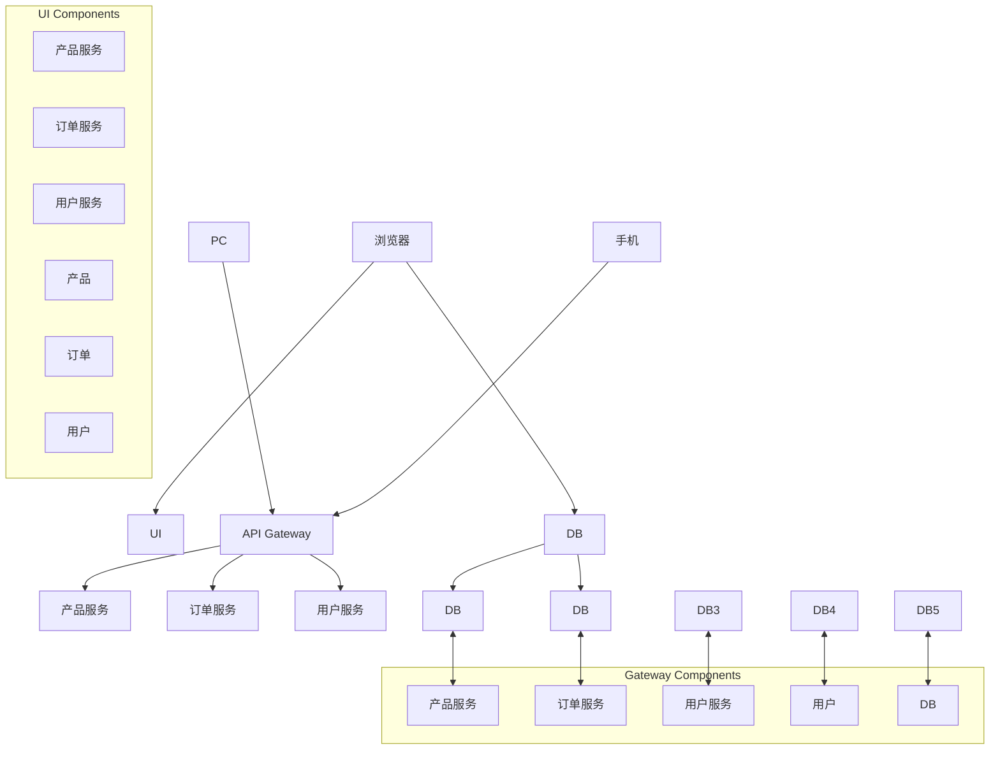

## 系统架构设计师

## SOA的设计原则

## 第十五章 面向服务架构设计理论与实践

15.1 SOA的相关概念  
15.2 SOA的参考架构  
15.3 SOA主要协议和规范  
⚫ 15.4 SOA的设计原则  
15.5 SOA的设计模式

flowchart

## SOA的设计原则如下：

(1)无状态。避免服务请求者依赖于服务提供者的状态。  
(2)单一实例。避免功能冗余。  
(3)明确定义的接口。服务的接口由 WSDL定义，用于指明服务的公共接口与其内部专用实现之间的界线。WS-Policy 用于描述服务规约，XML模式用于定义所交换的消息格式(即服务的公共数据)。使用者依赖服务规约调用服务，所以服务定义必须长时间稳定，一旦公布，不能随意更改；服务的定义应尽可能明确，减少使用者的不适当使用；不要让使用者看到服务内部的私有数据。

(4)自包含和模块化。服务封装了那些在业务上稳定、重复出现的活动和组件，实现服务的功能实体是完全独立自主的，独立进行部署、版本控制、自我管理和恢复。  
(5)粗粒度。服务数量不应该太大，依靠消息交互而不是远程过程调用(RPC)，通常消息量比较大，但是服务之间的交互频度较低。  
(6)服务之间的松耦合性。服务使用者看到的是服务的接口，其位置、实现技术和当前状态等对使用者是不可见的，服务私有数据对服务使用者是不可见的。  
(7)重用能力。服务应该是可以重用的。

(8)互操作性、兼容和策略声明。为了确保服务规约的全面和明确，策略成为一个越来越重要的方面。这可以是技术相关的内容，例如一个服务对安全性方面的要求；也可以是跟业务有关的语义方面的内容，例如需要满足的费用或者服务级别方面的要求，这些策略对于服务在交互时是非常重要的。WS-Policy 用于定义可配置的互操作语义来描述特定服务的期望、控制其行为。在设计时，应该利用策略声明确保服务期望和语义兼容性方面的完整和明确。

## 第十五章 面向服务架构设计理论与实践

15.1 SOA的相关概念  
15.2 SOA的参考架构  
15.3 SOA主要协议和规范  
15.4 SOA的设计原则  
⚫ 15.5 SOA的设计模式

## 服务注册表模式

服务注册表(Service Registry)主要在 SOA设计时使用，虽然它们常常也具有运行时段的功能。注册表包括有关服务和相关软件组件的配置、遵从性和约束配置文件。任何帮助注册发现和检索服务合同、元数据和策略的信息库、数据库、目录或其他节点都可以被认为是一个注册表。

flowchart

(1)服务注册：应用开发者，也叫服务提供者，向注册表公布他们的功能。他们公布服务合同，包括服务身份、位置、方法、绑定、配置、方案和策略等描述性属性。  
(2)服务位置：也就是服务应用开发，帮助他们查询注册服务，寻找符合自身要求的服务。注册表让服务的消费者检索服务合同。  
(3)服务绑定：服务的消费者利用检索到的服务合同来开发代码，开发的代码将与注册的服务绑定、调用注册的服务以及与它们实现互动。

## 二、企业服务总线模式

企业服务总线 (ESB)，提供一种标准的软件底层架构，各种程序组件能够以服务单元的方式“插入”到该平台上运行，并且组件之间能够以标准的消息通信方式来进行交互。

ESB 本质上是以中间件形式支持服务单元之间进行交互的软件平台。各种程序组件以标准的方式连接在该“总线”上，并且组件之间能够以格式统一的消息通信的方式来进行交互。

典型ESB 环境中组件间的交互过程是：首先由服务请求者触发一次交互过程，产生一个服务请求消息，并将该消息按照 ESB 的要求标准化，然后标准化的消息被发送给服务总线。ESB 根据请求消息中的服务名或者接口名进行目的组件查找，将消息转发至目的组件，并最终将处理结果逆向返回给服务请求者。这种交互过程不再是点对点的直接交互模式，而是由事件驱动的消息交互模式。 

通过这种方式，ESB 最大限度上解耦了组件之间的依赖关系，降低了软件系统互连的复杂性。连接在总线上的组件无需了解其他组件和应用系统的位置及交互协议，只需要向服务总线发出请求，消息即可获得所需服务。

服务总线事实上实现了组件和应用系统的位置透明和协议透明。技术人员可以通过开发符合 ESB标准的组件(适配器)将外部应用连接至服务总线，实现与其他系统的互操作。同时，ESB 以中间件的方式，提供服务容错、负载均衡、QoS 保障和可管理功能。

例：（ ）是由中间件技术实现并支持SOA的一组基础架构，它提供了一种基础设施，其优势在于（ ）。

A. ESB B.微服务 C.云计算 D. Multi-Agent System  
A.支持了服务请求者与服务提供者之间的直接链接  
B.支持了服务请求者与服务提供者之间的紧密耦合  
C.消除了服务请求者与服务提供者之间的直接链接  
D.消除了服务请求者与服务提供者之间的关系

## ESB的核心功能如下：

(1)提供位置透明的消息路由和寻址服务。  
(2)提供服务注册和命名的管理功能。  
(3)支持多种消息传递范型(如请求/响应、发布/订阅等)。  
(4)支持多种可以广泛使用的传输协议。  
(5)支持多种数据格式及其相互转换。  
(6)提供日志和监控功能。

## 三、微服务模式

2.微服务的概念

微服务架构是一种架构模式，将单体应用划分成一组小的服务，通过服务之间互相协作，共同实现系统功能。

flowchart

向上人生路!

## Thank You