## 系统架构设计师

## 通信系统网络架构

## 第十六章 通信系统架构设计理论与实践

⚫ 16.1 通信系统网络架构  
16.2 网络构建和设计方法

## 一、局域网网络架构

1.单核心架构  
2.双核心架构  
3.环形架构  
4.层次局域网架构

## 1.单核心架构

优点：网络结构简单，节省设备投资。

缺点：

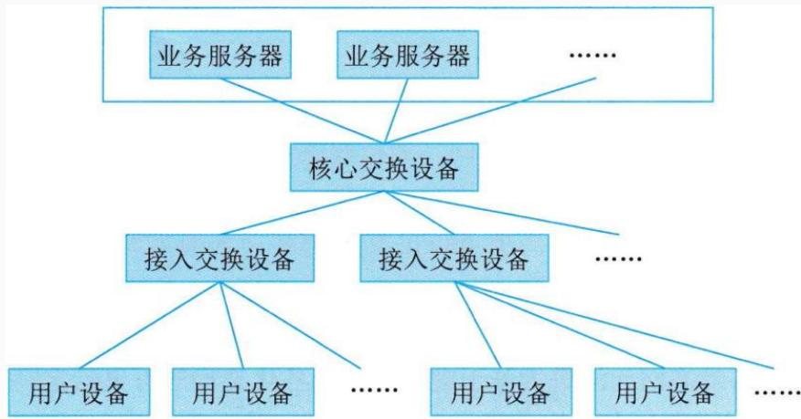

flowchart

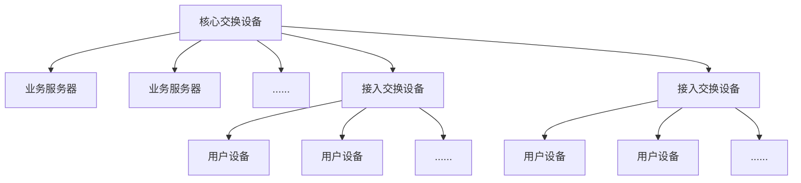
```mermaid
graph TD
  A["核心交换设备"] --> B["业务服务器"]
  A --> C["业务服务器"]
  A --> D["......"]
  A --> E["接入交换设备"]
  A --> F["接入交换设备"]
  E --> G["用户设备"]
  E --> H["用户设备"]
  E --> I["......"]
  F --> J["用户设备"]
  F --> K["用户设备"]
  F --> L["......"]
```

⚫ 网络地理范围受限，要求使用局域网的部门分布较为紧凑；  
⚫ 核心网交换设备存在单点故障，容易导致网络整体或局部失效；  
在局域网接入交换设备较多的情况下，对核心交换设备的端口密度要求高；  
网络扩展能力有限。

## 2.双核心架构

优点：

⚫ 核心交换设备之间互联，实现网关保护或负载均衡，可靠性高。  
需要使用局域网的部门接入较为方便，直接通过接入交换设备

连接至核心交换设备空闲接口即可。

业务服务器同时连接至两台核心交换设备，为用户提供高速访问。

缺点：

设备投资相比单核心局域网的高。  
对核心交换设备的端口密度要求较高。

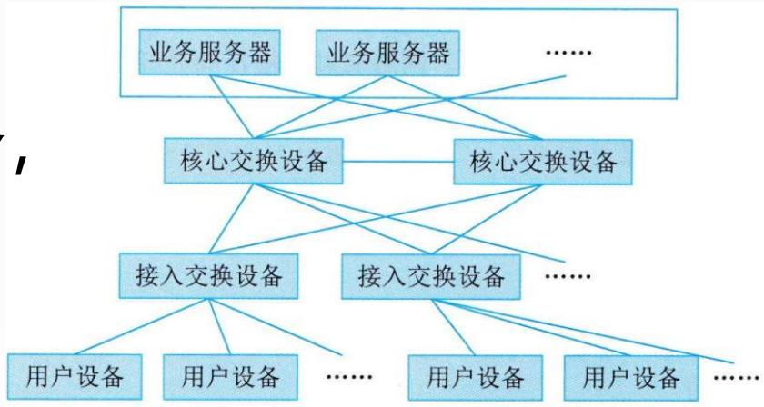

flowchart

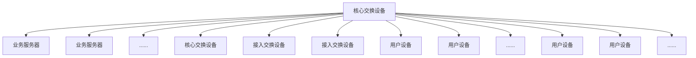
```mermaid
graph TD
  A["核心交换设备"] --> B["业务服务器"]
  A --> C["业务服务器"]
  A --> D["......"]
  A --> E["核心交换设备"]
  A --> F["接入交换设备"]
  A --> G["接入交换设备"]
  A --> H["用户设备"]
  A --> I["用户设备"]
  A --> J["......"]
  A --> K["用户设备"]
  A --> L["用户设备"]
  A --> M["......"]
```

## 3.环形架构

环型局域网是由多台核心交换设备连接成双RPR(动态弹性分组环)。

RPR具备自愈保护功能，省光纤资源，具备MAC层50ms 自愈时间的能力，提供多等级、可靠的QoS 服务，带宽公平机制和拥塞控制机制。RPR 环双向可用，RPR 利用空间重用技术，使得环上的

带宽得以有效利用。

## 缺点：

投资比单核心局域网高。  
核心路由冗余设计实施难度较高，容易形成环路。

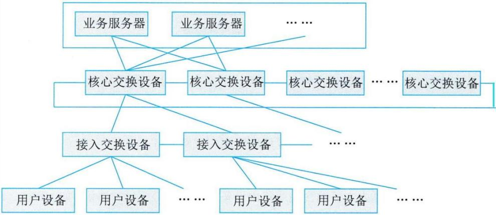

flowchart

```mermaid
graph TD
  A["核心交换设备"] --> B["核心交换设备"]
  A --> C["接入交换设备"]
  D["业务服务器"] --> A
  E["业务服务器"] --> A
  F["核心交换设备"] --> G["核心交换设备"]
  H["核心交换设备"] --> I["核心交换设备"]
  J["接入交换设备"] --> K["接入交换设备"]
  L["用户设备"] --> M["用户设备"]
  N["用户设备"] --> O["用户设备"]
  P["用户设备"] --> Q["用户设备"]
  R["用户设备"] --> S["用户设备"]
  T["用户设备"] --> U["用户设备"]
  V["用户设备"] --> W["用户设备"]
  X["用户设备"] --> Y["用户设备"]
  Z["用户设备"] --> AA["用户设备"]
  AB["用户设备"] --> AC["用户设备"]
  AD["用户设备"] --> AE["用户设备"]
  AF["用户设备"] --> AG["用户设备"]
  AH["用户设备"] --> AI["用户设备"]
  AJ["用户设备"] --> AK["用户设备"]
  AL["用户设备"] --> AM["用户设备"]
  AN["用户设备"] --> AO["用户设备"]
  AP["用户设备"] --> AQ["用户设备"]
  AR["用户设备"] --> AS["用户设备"]
  AT["用户设备"] --> AU["用户设备"]
  AV["用户设备"] --> AW["用户设备"]
  AX["用户设备"] --> AY["用户设备"]
  AZ["用户设备"] --> BA["用户设备"]
  BA --> BB["用户设备"]
  BC["用户设备"] --> BD["用户设备"]
  BA --> AB
  BA --> AC
  BA --> AD
  BA --> AE
  BA --> AF
  BA --> AG
  BA --> AH
  BA --> AI
  BA --> AJ
  BA --> AK
  BA --> AL
  BA --> AM
  BA --> AN
  BA --> AO
  BA --> AP
  BA --> AQ
  BA --> AR
  BA --> AS
  BA --> AT
  BA --> AU
  BA --> AV
  BA --> AW
  BA --> AX
  BA --> AZ
  BA --> BA["BA'"]
3D
```

## 4.层次局域网架构

层次局域网(或多层局域网)由核心层交换设备、汇聚层交换设备

和接入层交换设备，以及用户设备等组

核心层设备提供高速数据转发功能。  
汇聚层与接入层之间实现互访控制。聚层可提供所辖的不同接入设备(部门域网内)业务的交换功能，减轻对核心换设备的转发压力。  
⚫ 接入层设备实现用户设备的接入。

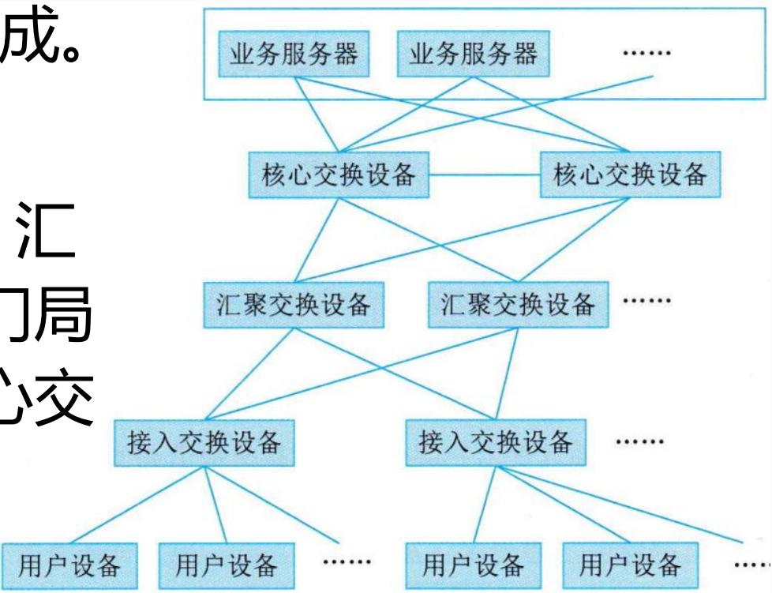

flowchart

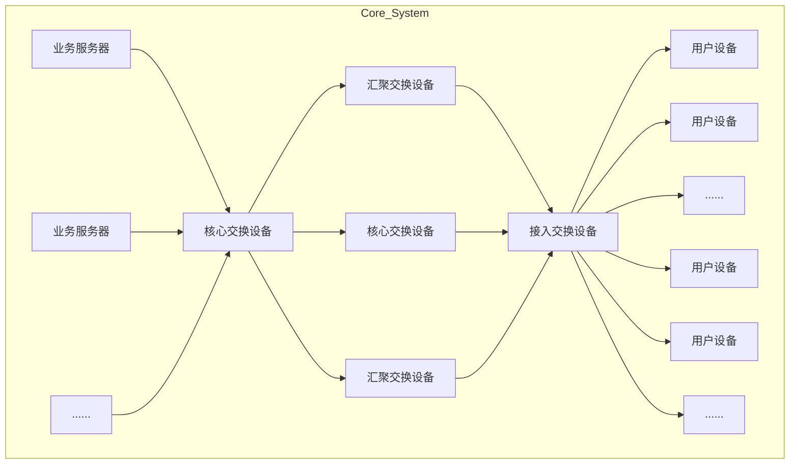
```mermaid
graph TD
  subgraph Core_System
  A["业务服务器"] --> B["核心交换设备"]
  C["业务服务器"] --> B
  D["......"] --> B
  B --> E["汇聚交换设备"]
  B --> F["核心交换设备"]
  B --> G["汇聚交换设备"]
  E --> H["接入交换设备"]
  F --> H
  G --> H
  H --> I["用户设备"]
  H --> J["用户设备"]
  H --> K["......"]
  H --> L["用户设备"]
  H --> M["用户设备"]
  H --> N["......"]
  end
```

层次局域网网络易于扩展；网络故障可分级排查，便于维护。通常，层次局域网通过与广域网的边界路由设备接入广域网，实现局域网和广域网业务互访。

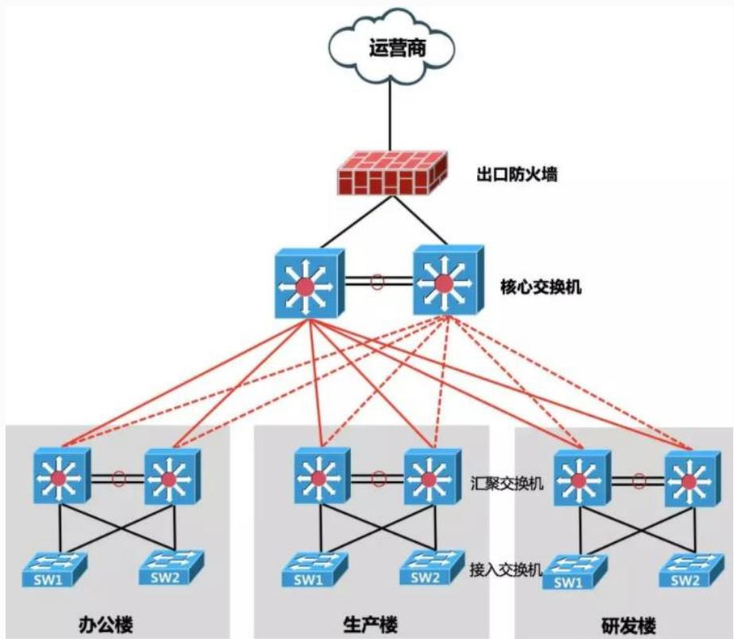

flowchart

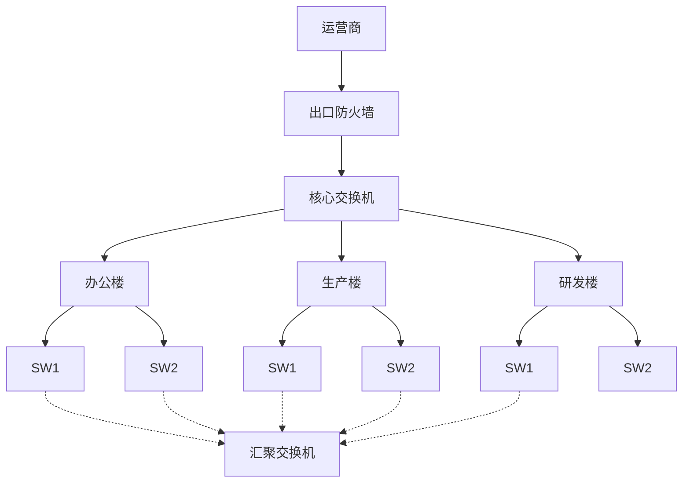
```mermaid
graph TD
  A["运营商"] --> B["出口防火墙"]
  B --> C["核心交换机"]
  C --> D["办公楼"]
  C --> E["生产楼"]
  C --> F["研发楼"]
  D --> G["SW1"]
  D --> H["SW2"]
  E --> I["SW1"]
  E --> J["SW2"]
  F --> K["SW1"]
  F --> L["SW2"]
  G -.-> M["汇聚交换机"]
  H -.-> M
  I -.-> M
  J -.-> M
  K -.-> M
```

## 二、广域网网络架构

1.单核心广域网  
2.双核心广域网  
3.环型广域网

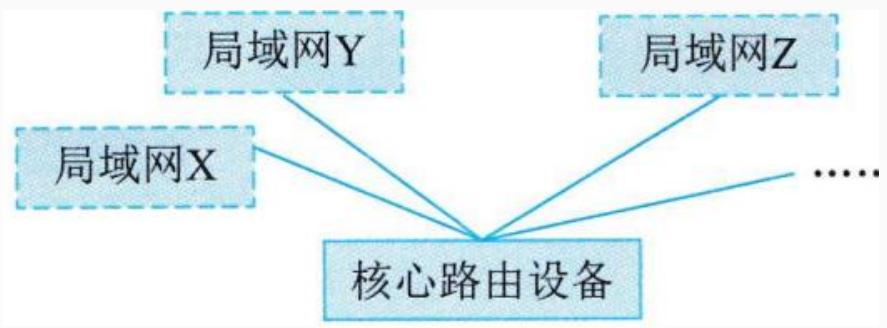

flowchart

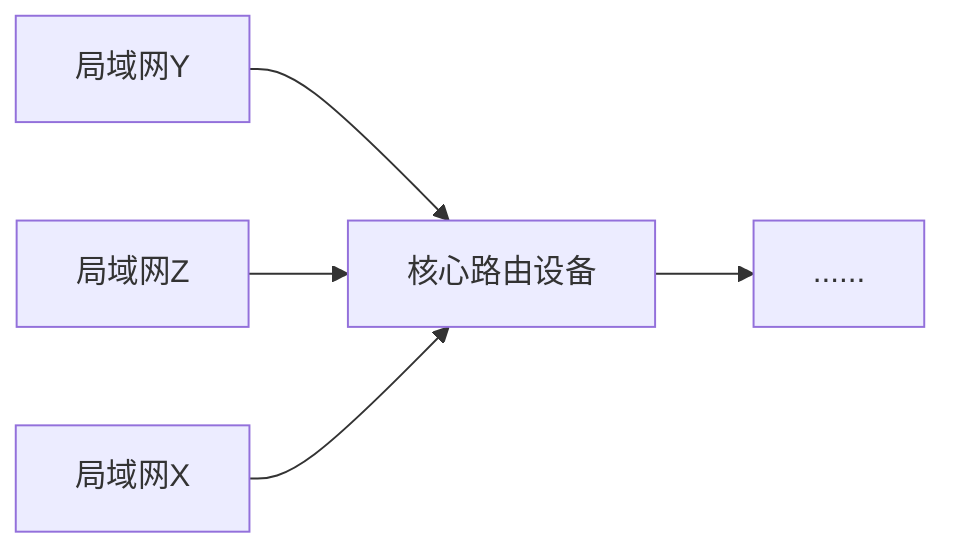
```mermaid
graph LR
  A["局域网Y"] --> C["核心路由设备"]
  B["局域网Z"] --> C
  D["局域网X"] --> C
  C --> E["......"]
```

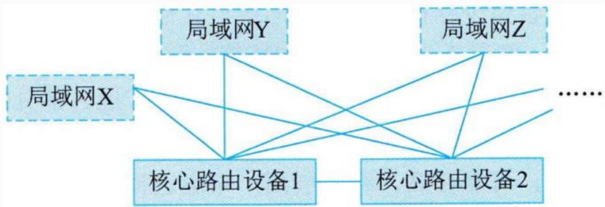

flowchart

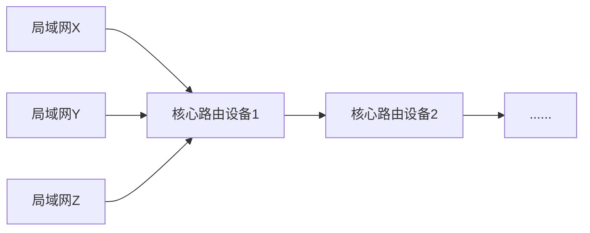
```mermaid
graph LR
  A["局域网X"] --> B["核心路由设备1"]
  C["局域网Y"] --> B
  D["局域网Z"] --> B
  B --> E["核心路由设备2"]
  E --> F["......"]
```

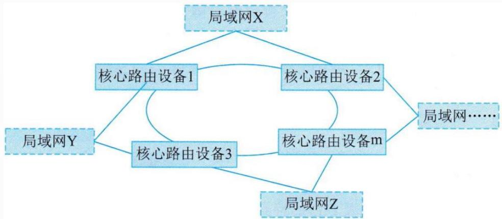

flowchart

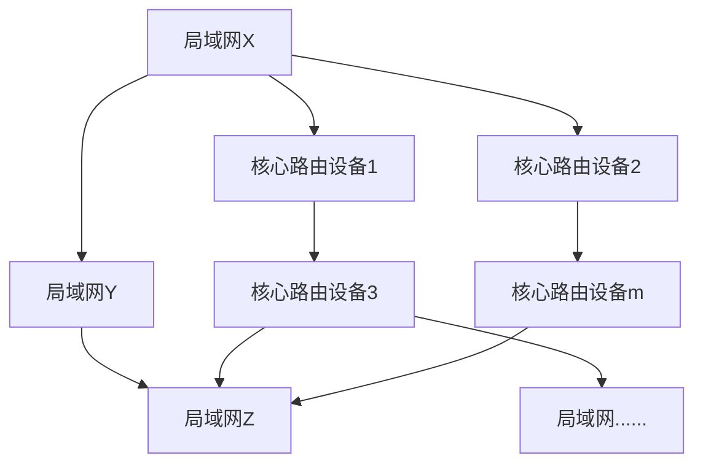
```mermaid
graph TD
  A["局域网X"] --> B["核心路由设备1"]
  A --> C["核心路由设备2"]
  A --> D["局域网Y"]
  B --> E["核心路由设备3"]
  C --> F["核心路由设备m"]
  D --> G["局域网Z"]
  E --> G
  F --> G
  E --> H["局域网......"]
```

## 4.半冗余广域网

半冗余广域网是由多台核心路由设备连接各局域网而形成的。其中任意核心路由设备至少存在两条以上连接至其他路由设备的链路。如果任何两个核心路由设备之间均存在链接，则属于半冗余广域网特例，即全冗余广域网。

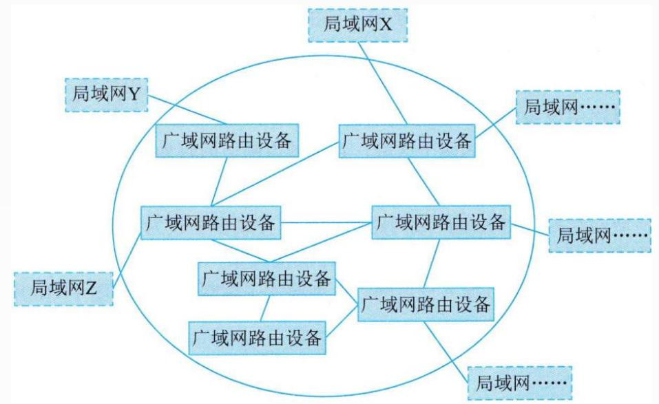

flowchart

This diagram illustrates the architecture of a network system, showing how multiple regional networks (X, Y, Z) connect to specific types of infrastructure such as '广域网路由设备' and '广域网路由设备'.

## 5.对等子域广域网

对等子域结构是指通过将广域网的路由器划分成两个独立的子域，每个子域内路由器采用半冗余方式互连。

对等子域结构中，两个子域间通过一条或多条链路互连，对等子域结构中任何路由器都可以接入局域网络。

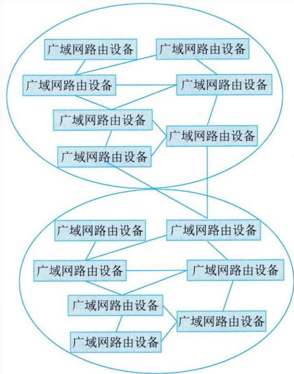

flowchart

```mermaid
graph TD
  subgraph Top Cluster
  A["广域网路由设备"] --> B["广域网路由设备"]
  C["广域网路由设备"] --> D["广域网路由设备"]
  E["广域网路由设备"] --> F["广域网路由设备"]
  G["广域网路由设备"] --> H["广域网路由设备"]
  I["广域网路由设备"] --> J["广域网路由设备"]
  K["广域网路由设备"] --> L["广域网路由设备"]
  M["广域网路由设备"] --> N["广域网路由设备"]
  O["广域网路由设备"] --> P["广域网路由设备"]
  Q["广域网路由设备"] --> R["广域网路由设备"]
  S["广域网路由设备"] --> T["广域网路由设备"]
  U["广域网路由设备"] --> V["广域网路由设备"]
  W["广域网路由设备"] --> X["广域网路由设备"]
  Y["广域网路由设备"] --> Z["广域网路由设备"]
  AA["广域网路由设备"] --> AB["广域网路由设备"]
  AC["广域网路由设备"] --> AD["广域网路由设备"]
  AE["广域网路由设备"] --> AF["广域网路由设备"]
  AG["广域网路由设备"] --> AH["广域网路由设备"]
  AI["广域网路由设备"] --> AJ["广域网路由设备"]
  AK["广域网路由设备"] --> AL["广域网路由设备"]
  AM["广域网路由设备"] --> AN["广域网路由设备"]
  AO["广域网路由设备"] --> AP["广域网路由设备"]
  AQ["广域网路由设备"] --> AR["广域网路由设备"]
  AS["广域网路由设备"] --> AT["广域网路由设备"]
  AU["广域网路由设备"] --> AV["广域网路由设备"]
  AW["广域网路由设备"] --> AX["广域网路由设备"]
  A --> Y
  B --> Z
  C --> AA
  D --> AB
  E --> AC
  F --> AD
  G --> AE
  H --> AF
  I --> AG
  J --> AH
  K --> AI
  L --> AJ
  M --> AK
  N --> AL
  O --> AP
  P --> AQ
  Q --> AR
  R --> AS
  S --> AT
  T --> AU
  U --> AV
  V --> AW
  W --> AX
  X --> AZ
  Y --> AB
  Z --> AC
  AA --> AD
  AB --> AE
  AC --> AF
  AD --> AG
  AE --> AH
  AF --> AI
  AG --> AJ
  AH --> AK
  AI --> AL
  AJ --> AM
  AK --> AN
  AL --> AO
  AM --> AP
  AN --> AQ
  AO --> AZ
  AP --> AB
  AQ --> AC
  AS --> AD
  AT --> AE
  AU --> AF
  AV --> AG
  AW --> AH
  AX --> AI
  AZ --> AJ
```

## 6.层次子域广域网

层次子域结构将大型广域网路由设备划分为多个较为独立的子域，每个子域内路由器采用半冗余方式互连。层次子域结构中，多个子域之间存在层次关系，高层子域连接多个低层子域。

层次子域结构中任何路由器都可以接入局域网络。

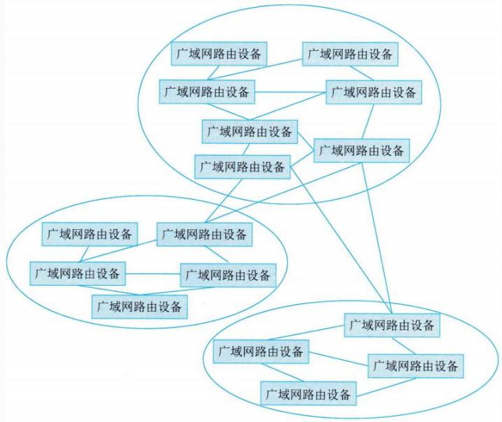

flowchart

This diagram illustrates the hierarchical structure of '广域网路由设备' (General Gateway Router Devices), showing how multiple sub-categories are grouped into three main levels with directional arrows indicating relationships or dependencies.

## 二、网络存储

目前主流的网络存储技术有三种：

1.直接附加存储(DAS)  
2.网络附加存储(NAS)  
3.存储区域网络(SAN)

## 1.直接附加存储(DAS)

在直连方式存储中，存储设备是通过电缆（通常是SCSI接口电缆）直接到服务器的，I/O请求直接发到存储设备。DAS也可称为服务器附加存储(SAS)。它依赖于服务器，其本身是硬件的堆叠，不带有任何存储操作系统。

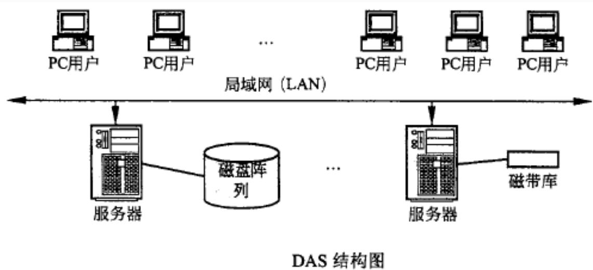

flowchart

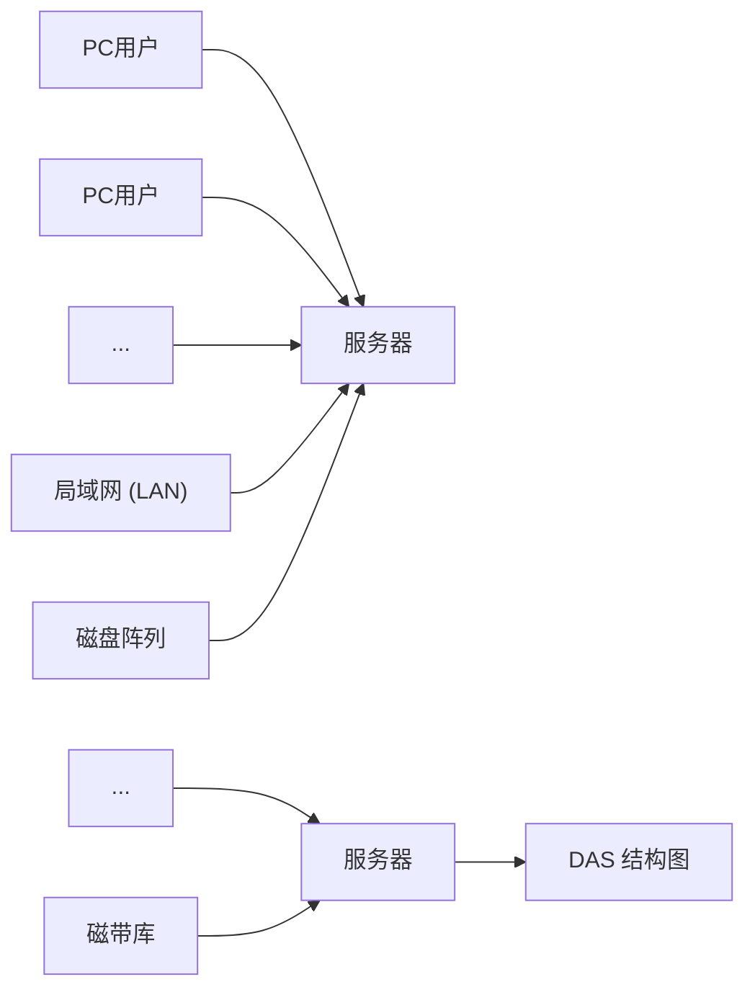
```mermaid
graph LR
  A["PC用户"] --> B["服务器"]
  C["PC用户"] --> B
  D["..."] --> B
  E["局域网 (LAN)"] --> B
  F["磁盘阵列"] --> B
  G["..."] --> H["服务器"]
  I["磁带库"] --> H
  H --> J["DAS 结构图"]
```

## 2.网络附加存储(NAS)

NAS是一种专用的数据存储服务器。它以数据为中心，将存储设备与服务器彻底分离，集中管理数据，从而提高性能、降低总拥有成本。其成本远远低于使用服务器存储，而效率却远高于后者。

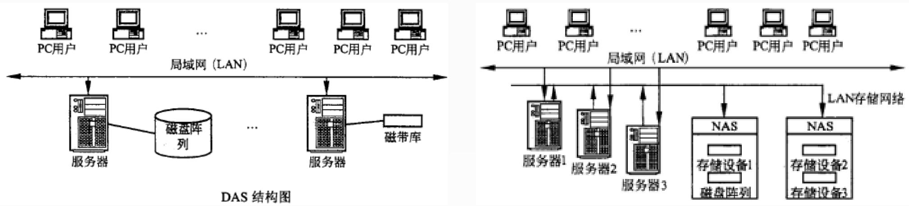

## 3.存储区域网络(SAN)

SAN是通过专用高速网将一个或多个网络存储设备和服务器连接起来的专用存储系统。利用SAN，不仅可以提供大容量的存储数据，而且地域上可以分散，并缓解了大量数据传输对于局域网的影响。

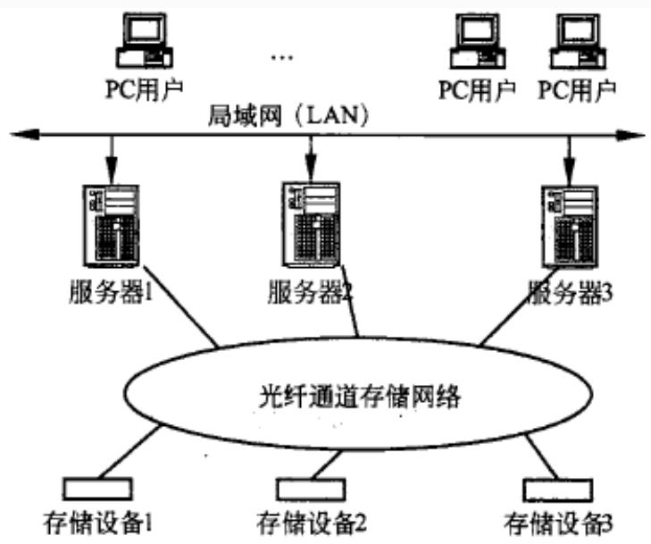

flowchart

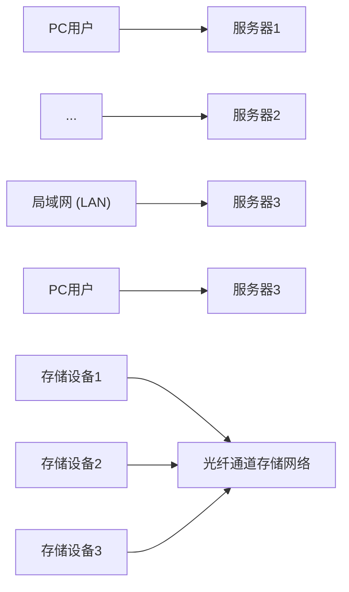
```mermaid
graph LR
  A["PC用户"] --> B["服务器1"]
  C["..."] --> D["服务器2"]
  E["局域网 (LAN)"] --> F["服务器3"]
  G["PC用户"] --> H["服务器3"]
  I["存储设备1"] --> J["光纤通道存储网络"]
  K["存储设备2"] --> J
  L["存储设备3"] --> J
```

图13-3 SAN体系结构

## 根据数据传输过程采用的协议，划分为：

FC SAN：FC指光纤通道，主要特征有支持热插拔、高速带宽、远程连接、连接设备数量大；缺点：成本高、复杂性大。  
IP SAN：基于IP网络实现数据块级别存储方式的存储网络。特点：设备成本低，配置简单，可共享和使用大容量存储空间。  
⚫ IB SAN：(IB:InfiniBand无限带宽)是一种交换结构 I/O技术，其设计思路是通过一套中心机构(IB交换机)在远程存储器、网络以及服务器等设备之间建立一个单一的连接链路，并由IB交换机来指挥流量。特点：高效可靠、支持多个虚信道较高容错性、支持热插拔。 

## 三、软件定义网络架构

## SDN架构中有三个层面：

应用平面：在网络上运行的应用及服务  
控制平面：SDN控制器或网络的"大脑"  
数据平面：交换机和路由器，以及其支撑的物理硬件

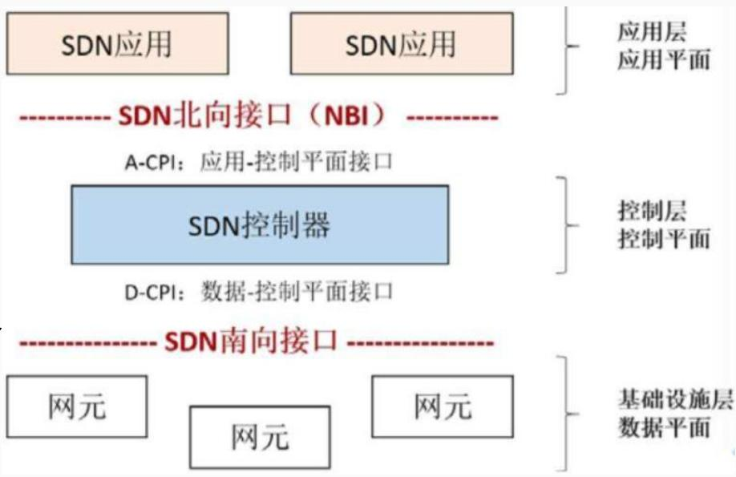

flowchart

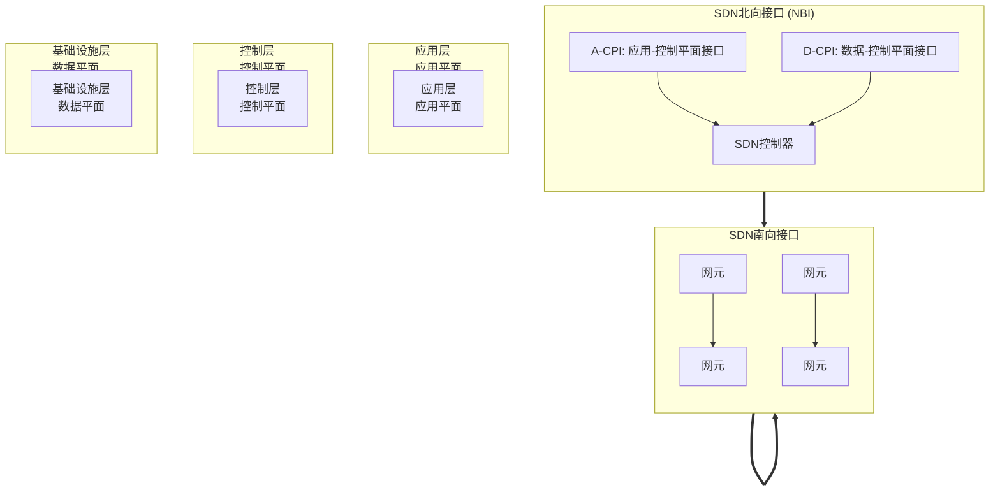
```mermaid
graph TD
  subgraph SDN_BN["SDN北向接口 (NBI)"]
    direction TB
  A["A-CPI: 应用-控制平面接口"] --> B["SDN控制器"]
  C["D-CPI: 数据-控制平面接口"] --> B
  end

  subgraph SDN_NR["SDN南向接口"]
    direction TB
  D["网元"] --> E["网元"]
  F["网元"] --> G["网元"]
  end

  subgraph ApplicationLayer["应用层\n应用平面"]
    direction TB
    H["应用层\n应用平面"]
  end

  subgraph ControlLayer["控制层\n控制平面"]
    direction TB
    I["控制层\n控制平面"]
  end

  subgraph InfrastructureLayer["基础设施层\n数据平面"]
    direction TB
    J["基础设施层\n数据平面"]
  end

  SDN_BN ==> SDN_NR
  SDN_NR ==> SDN_NR
```

控制平面与数据平面之间通过SDN控制-数据平面接口(CDPI)进行通信，它具有统一的通信标准，主要负责将控制器中的转发规则下发至转发设备，主要应用的是OpenFlow协议。  
控制平面与应用平面之间通过SDN北向接口(NBI)进行通信，而NBI并非统一标准，它允许用户根据自身需求定制开发各种网络管理应用。

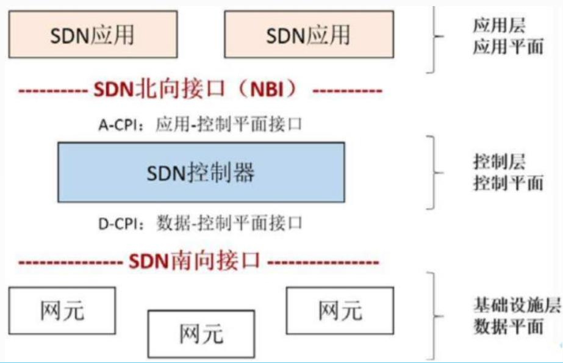

flowchart

This diagram illustrates the architecture of SDN (Synchronous Digital Network) in a control system, showing its application interface, NBI connection, controller interface, and network data flow.

## Thank You