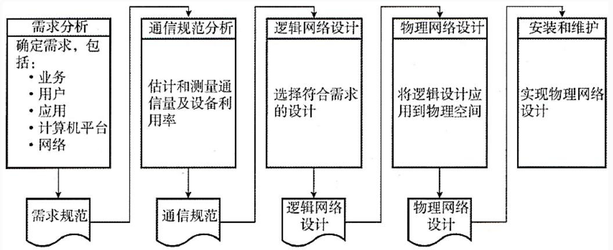
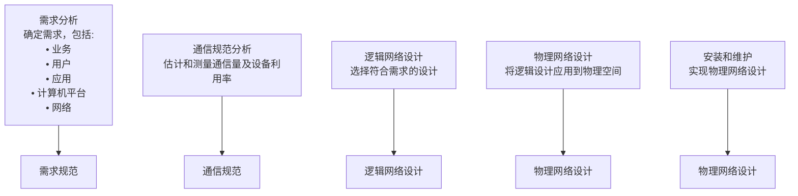
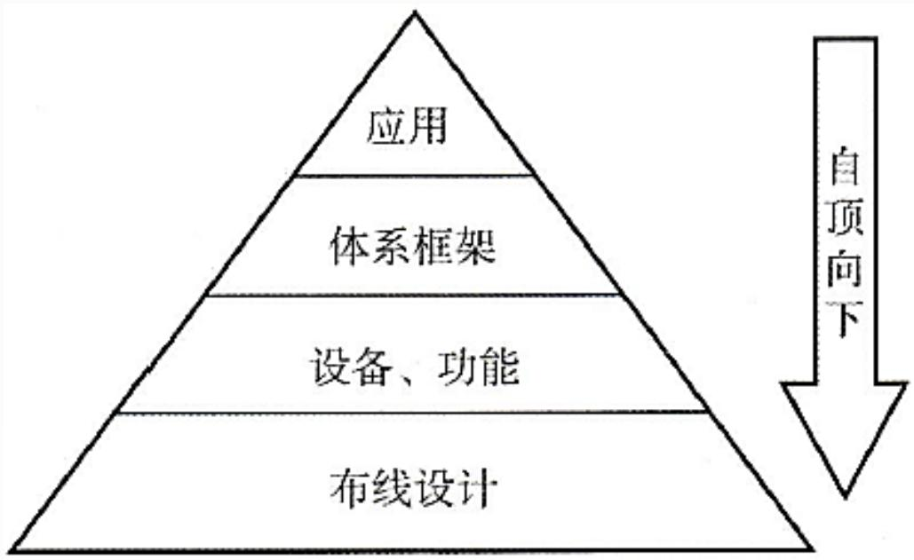
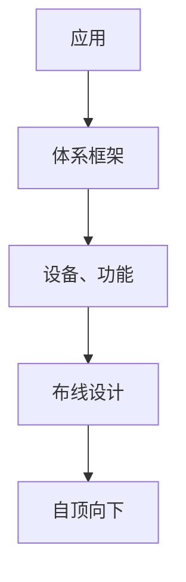
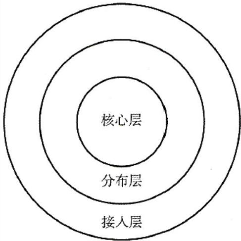
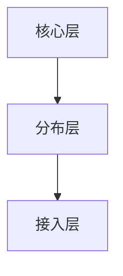
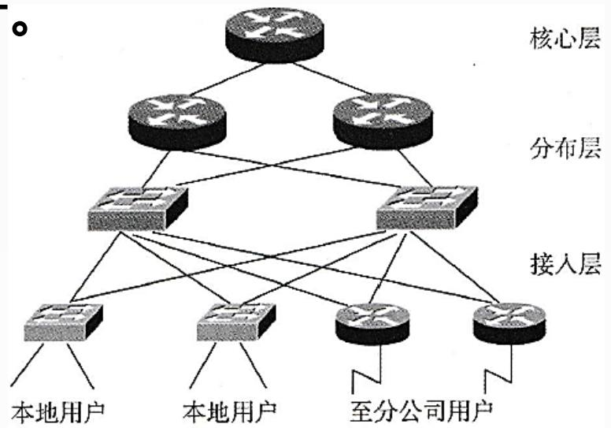
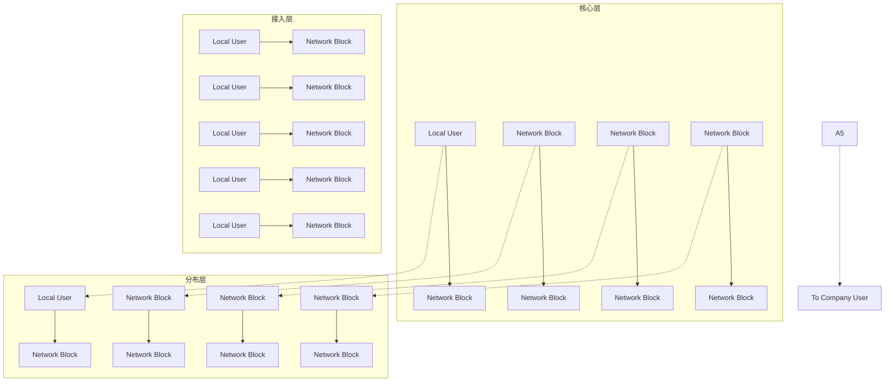

## 系统架构设计师

## 网络构建和设计方法

## 第十六章 通信系统架构设计理论与实践

16.1 通信系统网络架构  
⚫ 16.2 网络构建和设计方法

## 网络生命周期

一个网络系统从构思开始到最后被淘汰的过程被称为网络系统的生命周期。

网络系统的生命周期至少包括网络系统的构思计划、分析和设计、运行和维护等过程。

常见的迭代周期构成方式主要有三种：

四阶段周期  
五阶段周期  
六阶段周期

## 二、网络开发过程

根据五阶段迭代周期的模型，网络开发过程被划分为五个阶段：

需求分析  
现有网络系统分析，即通信规范分析  
确定网络逻辑结构，即逻辑网络设计  
确定网络物理结构，即物理网络设计  
安装和维护

flowchart

图3-5五阶段网络开发过程

## 1.需求分析

需求分析是开发过程最关键的阶段，在需求分析阶段应该尽量明确定义用户的需求，详细的需求描述使得最终的网络更有可能满足用户的要求。需求分析的输出是需求说明书，也就是需求规范。

不同的用户有不同的网络需求，收集需求需要考虑：

业务需求;  
用户需求;  
应用需求;  
计算机平台需求;  
网络需求。

## 获取用户需求的常用方法如下：

(1)访谈  
(2)观察  
(3)问卷调查  
(4)采访关键人物  
(5)建立原型以得到潜在用户的反馈

## 2.现有网络系统分析

现有网络系统分析的工作目的是描述资源分布，以便在升级时尽量保护已有投资。通过该工作，使网络设计者掌握网络现在所处的状态和情况。此阶段输出正式的通信规范说明文档，内容如下:

现有网络的逻辑拓扑图;  
反映网络容量、网段及网络所需的通信容量和模式;  
⚫ 详细的统计数据、基本的测量值和所有其他直接反映现有网络性能的测量值;  
Internet接口和广域网提供的服务质量(QoS)报告;  
限制因素列表清单，例如，使用线缆和设备等。

## 3.确定网络逻辑结构

网络逻辑结构设计是体现网络设计核心思想的关键阶段，在这一阶段根据需求规范和通信规范，选择一种比较适宜的网络逻辑结构，并实施后续的资源分配规划、安全规划等内容。

网络的逻辑结构设计来自于用户需求中描述的网络行为、性能等要求，逻辑设计要根据网络用户的分类、分布，形成特定的网络结构，该网络结构大致描述了设备的互连及分布，但是不对具体的物理位置和运行环境进行确定。逻辑网络设计阶段，设计人员一般更关注于网络层的连接图，涉及网络互联、地址分配、网络层流量等关键因素。 

此阶段最后应该得到一份逻辑网络设计文档，输出的内容包括以下几点:

逻辑网络设计图;  
IP地址方案;  
安全方案;  
具体的软硬件、广域网连接设备和基本的服务;  
招聘和培训网络员工的具体说明;  
⚫ 对软硬件、服务、员工和培训的费用的初步估计。

## 4.确定网络物理结构

物理网络设计是对逻辑网络设计的物理实现，通过对设备的具体物理分布、运行环境等的确定，确保网络的物理连接符合逻辑连接的要求。在这一阶段，网络设计者需要确定具体的软硬件、连接设备、布线和服务。网络物理结构设计文档的内容如下:

网络物理结构图和布线方案;  
设备和部件的详细列表清单;  
软硬件和安装费用的估算;  
⚫ 安装日程表，详细说明服务的时间以及期限;  
安装后的测试计划;  
用户的培训计划。

## 5.安装和维护

## 1)安装

安装阶段是根据前面各个阶段的工程成果，实施环境准备、设备安装调试的过程。安装阶段的主要输出是网络本身。安装阶段应该产生的输出如下:

⚫ 逻辑网络图和物理网络图，以便于管理人员快速掌握网络;  
⚫ 满足规范的设备连接图、布线图等细节图，同时包括线缆、连接器和设备的规范标识;  
⚫ 运营维护记录和文档，包括测试结果和新的数据流量记录。

## 2)维护

网络维护又称为网络产品的售后服务。网络安装完成后，接受用户的反馈意见和监控是网络管理员的任务。网络投入运行后，需要做大量的故障监测和故障恢复以及网络升级和性能优化等维护工作。

## 三、网络设计方法

计算机网络设计通常采用自顶向下(Top-Down)的模块化设计方法，即从网络模型上层开始，直至底层，最终确定各模块，满足应用需求。

flowchart

图3-6自顶向下的网络设计方法

## 1.层次化网络设计模型

层次化模型由外向内由接入层、分布层和核心层三个功能层组成

⚫ 接入层：为用户提供接入网络的服务，也称为访问层。  
⚫ 分布层：提供用户到核心层之间的连接，也称为汇聚层。  
核心层：高速的网络骨干。

flowchart

图3-7层次化网络设计模型

flowchart

图3-8网络拓扑图到层次化模型的映射

## 1)接入层

接入层又称访问层，是用户接入网络的地方，用户可以是本地的，也可以是远程的。接入层可以通过集线器、交换机、网桥、路由器和无线访问点为本地用户提供接入服务，也可以通过VPN技术让远程用户经Internet接入内部网络。接入层往往需要有相应的策略来保证只有授权用户才可接入网络。

2)分布层

又称汇聚层，是核心层和接入层之间的接口。分布层的功能和特性如下:

(1)通过过滤、优先级和业务排队来实现策略。  
(2)在接入层和核心层之间进行路由选择。如果在接入层和核心层使用的路由协议不同，那么分布层负责在各路由协议之间重新共享路由信息，如果有必要还需要对路由信息进行过滤。  
(3)执行路由汇总。当路由被汇总后，路由器只需要在路由表中保

存较少的汇总路由信息，这会使路由表变小，减少路由器查找路由表时间和对内存的需求。此外路由的更新信息也会减少，从而占用的网络带宽减少。

(4)提供到接入设备和核心设备的冗余连接。  
(5)把多个低速接入的连接汇聚到高速的核心连接上，如果有必要，还需要在不同的传输介质之间转换。

## 3)核心层

核心层提供高速的网络主干。核心层的功能和属性如下:

(1)为了在骨干网上快速地传输数据，核心层应具有高速度、低延时的链路和设备。  
(2)通过提供冗余设备和链路使得网络不存在单点故障，从而实现高可靠的网络骨干。  
(3)使用快速收敛路由协议可以迅速适应网络变化。路由协议还可以在冗余链路上配置负载均衡，以便备份的网络资源在没有网络故障发生时也能得到利用。因为过滤往往会降低处理速度，所以般核心层不执行过滤功能，而将过滤操作放在分布层上执行。

4)层次化模型的优点：

(1)三层结构减轻了内层网络主设备的负载。由于分布层的过滤和汇聚，使得核心层设备避免了处理大量细节路由信息，降低CPU开销和网络带宽消耗。  
(2)降低了网络成本。按不同层次功能要求选择网络设备，可以降低不必要的功能投入花费。此外，层次化的模型结构便于网络管理，降低网络运行维护花费。  
(3)简化了设计元素，使设计易于理解。  
(4)容易变更层次结构。局部升级不会影响其他部分，扩展方便。

## Thank You