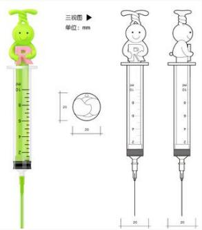
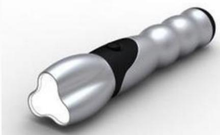
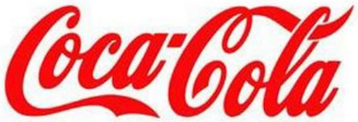
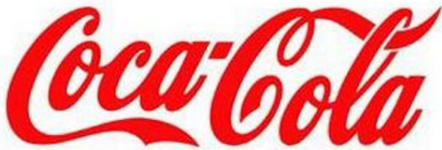

## 系统架构设计师

## 其他相关知识

## 第十七章 知识产权与法律法规

17.1 著作权法  
17.2 计算机软件保护条例  
⚫ 17.3 其他相关知识

## 专利权

包括发明、实用新型和外观设计三种

text_image

三视图 ▶
单位：mm

natural_image

Close-up of a metallic, textured tool with a black handle and white tip (no text or symbols visible)

(1)发明：是指对产品、方法或者其改进所提出的新的技术方案。科学发现不属于发明范畴。  
(2)实用新型：是指对产品的形状、构造或者其结合所提出的适于实用的新的技术方案。  
(3)外观设计：又称工业产品外观设计，是指对产品的形状、图案或者其结合以及色彩与形状、图案相结合所作出的富有美感并适于工业上应用的新设计。高级项目经理

一份专利申请文件只能就一项发明创造提出专利申请。一项发明只授予一项专利，同样的发明申请专利，则按照申请时间的先后决定授予给谁。

两个以上的申请人在同一日分别就同样的发明创造申请专利的，应当在收到国务院专利行政部门的通知后自行协商确定申请人。

## 1 . 专利权的期限

发明专利权的期限为20年，实用新型专利权、外观设计专利权的期限为10年，均自申请日起计算。

此处的申请日，是指向国务院专利行政主管部门提出专利申请之日。

## 2 . 专利权人的义务

在保护期内，专利权人应该按时缴纳年费。在专利权保护期限内，如果专利权人没有按规定缴纳年费，或者以书面声明放弃其专利权，专利权可以在期满前终止。

## 二、商标权

## 1．商标的概念

商标指生产者及经营者为使自己的商品或服务与他人的商品或服务相区别，而使用在商品及其包装上或服务标记上的由文字、图形、字母、数字、三维标志和颜色组合，以及上述要素的组合所构成的一种可视性标志。

text_image

Coca-Cola

作为一个商标，应满足以下三个条件

(1)商标是用在商品或服务上的标记，与商品或服务不能分离，并依附于商品或服务。  
(2)商标是区别于他人商品或服务的标志，应具有特别显著性的区别功能，从而便于消费者识别。  
(3)商标的构成是一种艺术创造，可以是由文字、图形、字母、数字、三维标志和颜色组合，以及上述要素的组合构成的可视性标志。

text_image

Coca-Cola

两个或者两个以上的申请人，在同一种商品或者类似商品上，分别以相同或者近似的商标在同一天申请注册的，各申请人应当自收到商标局通知之日起30日内提交其申请注册前在先使用该商标的证据。

同日使用或者均未使用的，各申请人可以自收到商标局通知之日起30日内自行协商，并将书面协议报送商标局；  
⚫ 不愿协商或者协商不成的，商标局通知各申请人以抽签的方式确定一个申请人，驳回其他人的注册申请。  
商标局已经通知但申请人未参加抽签的，视为放弃申请，商标局应当书面通知未参加抽签的申请人。

注册商标的有效期限为10年，自核准注册之日起计算。

⚫ 注册商标有效期满，需要继续使用的，应当在期满前6个月内申请续展注册；  
在此期间未能提出申请的，可以给予6个月的宽展期。  
⚫ 宽展期满仍未提出申请的，注销其注册商标。  
每次续展注册的有效期为10年。

## Thank You